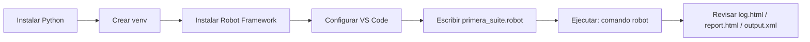

{width=120px}

# Práctica 1: Instalación del entorno y ejecución del primer test case

## Metadatos

| Campo            | Detalle                                       |
|------------------|------------------------------------------------|
| **Duración**     | 72 minutos                                      |
| **Complejidad**  | Fácil                                           |
| **Nivel Bloom**  | Aplicar (Apply)                                 |
| **Capítulo**     | 1 — Fundamentos de Automatización y Robot Framework |
| **Versión RF**   | Robot Framework 7.x                             |

---

## Descripción general

En esta práctica vas a montar, desde cero, el entorno con el que trabajarás durante todo el curso: Python, un entorno virtual (`venv`), Robot Framework y VS Code. Después escribirás y ejecutarás tu primera suite de pruebas `.robot`, y revisarás los reportes que Robot Framework genera automáticamente.

No necesitas saber programar para esta práctica — solo seguir los pasos en orden. Si algo no funciona, cada paso tiene su propia sección de verificación para que sepas si puedes continuar.



```{=typst}
#flujo-vertical(("Instalar Python", "Crear venv", "Instalar Robot Framework", "Configurar VS Code", "Escribir primera_suite.robot", "Ejecutar: comando robot", "Revisar log.html / report.html / output.xml"))
```

---

## Objetivos de aprendizaje

Al terminar esta práctica vas a poder:

- Instalar y verificar Python 3.10+, Robot Framework 7.x y la extensión de VS Code.
- Explicar, con tus propias palabras, la diferencia entre **automatización de pruebas** y **RPA**.
- Escribir un archivo `.robot` con sus cuatro secciones: `Settings`, `Variables`, `Test Cases` y `Keywords`.
- Ejecutar una suite desde la terminal y leer el resultado.
- Encontrar y abrir los tres archivos de reporte (`log.html`, `report.html`, `output.xml`).

---

## Prerrequisitos

| Requisito | Nivel |
|---|---|
| Uso básico de terminal (`cd`, `mkdir`, `ls`/`dir`) | Básico |
| Conexión a internet | Activa |
| Permisos de administrador en tu equipo | Confirmados |

---

## Idea clave antes de empezar: ¿pruebas o RPA?

Estos dos conceptos se confunden mucho. La tabla resume la diferencia — la vas a necesitar en el Paso 3.

| | Automatización de pruebas | RPA |
|---|---|---|
| **¿Para qué sirve?** | Verificar que el software funciona bien | Ejecutar un proceso de negocio sin intervención humana |
| **¿Qué produce?** | Un reporte de PASS/FAIL | Un resultado operativo (factura cargada, correo enviado, etc.) |
| **¿Quién lo lee?** | Equipo de QA / desarrollo | Áreas operativas del negocio |
| **Ejemplo** | "El botón Pagar muestra el mensaje correcto" | "Descargar facturas PDF del correo y cargarlas al ERP" |

Robot Framework es una de las pocas herramientas que cubre **ambos** mundos con la misma sintaxis. Por eso lo vas a usar en los dos contextos a lo largo del curso (pruebas en las Sesiones 2-7, RPA en la Sesión 8).

```{=typst}
#comparacion(
  titulo-a: "Automatización de pruebas",
  items-a: ("Verifica calidad del software", "Produce reporte PASS / FAIL", "Audiencia: equipo QA / Dev"),
  titulo-b: "RPA",
  items-b: ("Ejecuta procesos de negocio", "Produce un resultado operativo", "Audiencia: áreas operativas"),
)
```

---

## Entorno del laboratorio

### Software que instalarás

| Herramienta | Versión objetivo |
|---|---|
| Python | 3.10 o superior |
| Robot Framework | 7.x |
| VS Code + Robot Framework Language Server | última estable |

### Estructura de carpetas al finalizar

```
robfram-code/
└── sesion-01/
    └── practica-01-primer-test/
        ├── tests/
        │   └── primera_suite.robot
        └── reports/
            ├── log.html
            ├── report.html
            └── output.xml
```

---

## Pasos de la práctica

### Paso 1 — Verificar Python

```bash
# macOS / Linux
python3 --version

# Windows
python --version
```

Debe responder `Python 3.10.x` o superior. Si no tienes Python instalado, descárgalo de [python.org/downloads](https://www.python.org/downloads/) — en Windows, marca **"Add Python to PATH"** durante la instalación.

**Verificación:** el comando responde con una versión 3.10 o mayor, sin errores.

---

### Paso 2 — Crear el proyecto y el entorno virtual

> ⚠️ **Importante:** todo el curso se trabaja dentro de un entorno virtual (`venv`). Nunca instales Robot Framework de forma global — evita conflictos con otros proyectos de tu equipo.

```bash
mkdir -p robfram-code/sesion-01/practica-01-primer-test
cd robfram-code/sesion-01/practica-01-primer-test

# Crear el entorno virtual
python3 -m venv venv
```

Para activarlo, ejecuta **solo la línea que corresponde a tu sistema operativo**:

```bash
source venv/bin/activate          # macOS / Linux
```

```bat
venv\Scripts\activate.bat         # Windows (cmd)
```

```powershell
venv\Scripts\Activate.ps1         # Windows (PowerShell)
```

**Verificación:** tu terminal debe mostrar el prefijo `(venv)` al inicio del prompt.

---

### Paso 3 — Instalar Robot Framework

```bash
pip install --upgrade pip
pip install robotframework
robot --version
```

Salida esperada: `Robot Framework 7.x.x (Python 3.x.x on ...)`.

**Verificación:** el número mayor de versión debe ser **7**.

---

### Paso 4 — Configurar VS Code

1. Instala la extensión **Robot Framework Language Server** (`robocorp.robotframework-lsp`) desde el panel de extensiones (`Ctrl+Shift+X`).
2. Abre la carpeta del proyecto: `code .`
3. Selecciona el intérprete del venv con `Ctrl+Shift+P` → `Python: Select Interpreter`.

**Verificación:** al crear un archivo `.robot` y escribir `*** Test Cases ***`, debe aparecer resaltado de sintaxis.

---

### Paso 5 — Escribir tu primera suite

Crea `tests/primera_suite.robot` con este contenido. Lee los comentarios (líneas con `#`) — explican cada sección:

```robot
*** Settings ***
# BuiltIn es la librería nativa de Robot Framework: no necesita "Library"
# explícito. Documentation describe el propósito de la suite.
Documentation     Práctica 1 — primera suite con las cuatro secciones.


*** Variables ***
# Variable escalar (${...}): un solo valor.
${NOMBRE_CURSO}          Robot Framework 7
${HERRAMIENTA_PRUEBAS}    Robot Framework
${HERRAMIENTA_RPA}        Robot Framework

# Variable de lista (@{...}): varios valores.
@{DOMINIOS_RF}           Automatización de Pruebas    RPA    Automatización Web


*** Test Cases ***
TC-01 Verificar que el curso tiene nombre asignado
    [Documentation]    Confirma que ${NOMBRE_CURSO} no está vacía.
    Log    Iniciando TC-01
    Should Not Be Empty    ${NOMBRE_CURSO}

TC-02 Verificar que la misma herramienta cubre pruebas y RPA
    Should Be Equal    ${HERRAMIENTA_PRUEBAS}    ${HERRAMIENTA_RPA}
    Log    Ambas variables apuntan a: ${HERRAMIENTA_PRUEBAS}

TC-03 Verificar que Robot Framework abarca los tres dominios esperados
    Verificar Dominio En Lista    Automatización de Pruebas
    Verificar Dominio En Lista    RPA
    Verificar Dominio En Lista    Automatización Web


*** Keywords ***
Verificar Dominio En Lista
    [Documentation]    Verifica que un dominio existe en @{DOMINIOS_RF}.
    [Arguments]    ${dominio}
    Should Contain    ${DOMINIOS_RF}    ${dominio}
    Log    Dominio confirmado: ${dominio}
```

**Verificación de sintaxis (sin ejecutar):**

```bash
robot --dryrun tests/primera_suite.robot
```

Debe terminar con `1 suite, 3 tests, 3 passed, 0 failed`.

---

### Paso 6 — Ejecutar la suite

```bash
robot --outputdir reports tests/primera_suite.robot
```

Salida esperada (resumida):

```
==============================================================================
Primera Suite
==============================================================================
TC-01 Verificar que el curso tiene nombre asignado            | PASS |
TC-02 Verificar que la misma herramienta cubre pruebas y RPA   | PASS |
TC-03 Verificar que Robot Framework abarca los tres dominios   | PASS |
==============================================================================
3 tests, 3 passed, 0 failed
==============================================================================
Output:  .../reports/output.xml
Log:     .../reports/log.html
Report:  .../reports/report.html
```

> Nota: en tu terminal, Robot Framework recorta los nombres largos de los test cases para que la línea quepa en el ancho de la consola — por eso el texto real puede verse truncado de forma distinta a este ejemplo. Lo importante es que las tres líneas terminen en `| PASS |` y el resumen diga `3 tests, 3 passed, 0 failed`.

| Elemento | Significado |
|---|---|
| `output.xml` | Datos en bruto de la ejecución — la fuente de verdad |
| `log.html` | Detalle paso a paso de cada keyword ejecutada |
| `report.html` | Resumen ejecutivo con estadísticas |

**Verificación:** los tres test cases muestran `PASS` y el resumen dice `3 tests, 3 passed, 0 failed`.

---

### Paso 7 — Explorar los reportes

Abre `reports/report.html` en tu navegador. Debe mostrar **3/3 tests passed** en verde.

Abre `reports/log.html` y expande `TC-02` — vas a ver el mensaje `Log` que escribiste en el test case.

---

## Validación y pruebas

```bash
python3 --version
robot --version
robot --outputdir reports tests/primera_suite.robot
```

### Lista de verificación final

| Criterio | Estado |
|---|---|
| Python 3.10+ instalado | ☐ |
| Robot Framework 7.x instalado | ☐ |
| Entorno virtual activo (`(venv)` visible) | ☐ |
| Suite ejecutada: `3 tests, 3 passed, 0 failed` | ☐ |
| `log.html`, `report.html`, `output.xml` generados | ☐ |

---

## Solución de problemas

### "robot no se reconoce" / "command not found: robot"

**Causa:** el venv no está activo.
**Solución:** activa el venv (Paso 2) y verifica con `pip show robotframework`.

### El test falla con `AssertionError`

**Causa común:** indentación mezclada de tabs y espacios, o falta de espacio entre celdas (Robot Framework separa columnas con 2+ espacios o un tab).
**Solución:** vuelve a copiar el bloque del Paso 5 completo, sin modificarlo, y revisa que no haya tabulaciones invisibles.

---

## Resumen

- **Automatización de pruebas** verifica calidad → reporte PASS/FAIL. **RPA** ejecuta procesos de negocio → resultado operativo. Robot Framework cubre ambos.
- Un archivo `.robot` tiene 4 secciones: `Settings`, `Variables`, `Test Cases`, `Keywords`.
- El comando `robot` siempre genera `output.xml`, `log.html` y `report.html`.

### Próximos pasos

En la **Práctica 2** vas a analizar a fondo esos tres archivos de reporte, incluyendo cómo leer un `output.xml` con código Python.

### Recursos

| Recurso | URL |
|---|---|
| Documentación oficial | <https://robotframework.org/> |
| User Guide | <https://docs.robotframework.org/docs> |
| Keywords BuiltIn | <https://robotframework.org/robotframework/latest/libraries/BuiltIn.html> |
