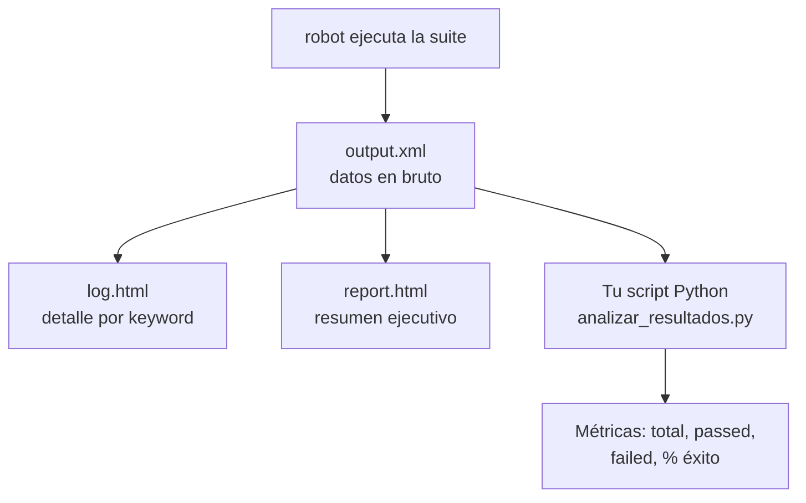

# Práctica 2: Análisis del reporte HTML generado

## Metadatos

| Campo            | Detalle                                       |
|------------------|------------------------------------------------|
| **Duración**     | 72 minutos                                      |
| **Complejidad**  | Fácil                                           |
| **Nivel Bloom**  | Analizar (Analyze)                              |
| **Capítulo**     | 1 — Fundamentos de Automatización y Robot Framework |
| **Versión RF**   | Robot Framework 7.x                             |

---

## Descripción general

En la Práctica 1 ejecutaste tu primera suite y viste que Robot Framework genera tres archivos: `output.xml`, `log.html` y `report.html`. En esta práctica vas a entender **qué información vive en cada uno** y vas a escribir un pequeño script en Python que lee `output.xml` y calcula métricas — la base de cualquier *quality gate* automático en CI/CD (tema que retomas en la Sesión 9).



```{=typst}
#flujo-vertical(("robot ejecuta la suite", "output.xml (datos en bruto)", "log.html / report.html / analizar_resultados.py", "Métricas: total, passed, failed, % éxito"))
```

---

## Objetivos de aprendizaje

- Identificar qué información contiene cada uno de los tres reportes.
- Explicar por qué `output.xml` es la "fuente de verdad" de la ejecución.
- Leer el nodo `<statistics>` de un `output.xml` con Python (`xml.etree.ElementTree`).
- Escribir un test unitario con `pytest` que valide ese código.

---

## Prerrequisitos

| Área | Nivel |
|---|---|
| Práctica 1 completada (venv + Robot Framework instalados) | Requerido |
| Python básico (funciones, `import`) | Básico |

---

## Por qué importa `output.xml`

`report.html` y `log.html` son **vistas** generadas a partir de `output.xml`. Si pierdes el `.xml`, no puedes regenerar los otros dos; si lo conservas, puedes:

- Volver a generar los reportes HTML en cualquier momento con `rebot` (lo verás en la Sesión 9).
- Combinar varias ejecuciones en un solo reporte.
- Leerlo con código (este es el objetivo de hoy) para construir *dashboards* o decidir si un pipeline de CI/CD debe continuar o detenerse.

---

## Pasos de la práctica

### Paso 1 — Generar una ejecución con un PASS y un FAIL

Para tener datos reales que analizar, vas a crear una suite que falla a propósito en un caso:

```robot
*** Settings ***
Documentation     Suite con un caso PASS y uno FAIL a propósito.

*** Test Cases ***
TC-01 Caso que debe pasar
    Should Be Equal    ${1}    ${1}

TC-02 Caso que debe fallar a propósito
    [Tags]    fallo-esperado
    Should Be Equal    ${1}    ${2}
```

Guárdalo como `tests/suite_demo.robot` y ejecútalo:

```bash
robot --outputdir reports tests/suite_demo.robot
```

**Salida esperada:** `2 tests, 1 passed, 1 failed`. El comando termina con código de salida `1` — eso es **normal**: Robot Framework usa el exit code para indicar que hubo fallos, justamente lo que un pipeline de CI/CD necesita para decidir si bloquea un despliegue.

Puedes comprobar ese código de salida justo después de ejecutar el comando anterior:

```bash
echo $?            # macOS / Linux: debe imprimir 1
```

```bat
echo %errorlevel%  # Windows (cmd): debe imprimir 1
```

---

### Paso 2 — Inspeccionar `output.xml` a mano

Abre `reports/output.xml` en VS Code y busca el bloque `<statistics>`:

```xml
<statistics>
<total>
<stat pass="1" fail="1" skip="0">All Tests</stat>
</total>
...
</statistics>
```

Ahí está todo lo que necesitas: cuántos tests pasaron (`pass`), cuántos fallaron (`fail`) y cuántos se omitieron (`skip`).

---

### Paso 3 — Escribir `analizar_resultados.py`

Crea `scripts/analizar_resultados.py`:

```python
"""Lee el output.xml de Robot Framework y extrae sus métricas clave."""
from __future__ import annotations

import xml.etree.ElementTree as ET
from dataclasses import dataclass
from pathlib import Path


@dataclass
class Metricas:
    total: int
    passed: int
    failed: int
    skipped: int = 0

    @property
    def pass_rate(self) -> float:
        if self.total == 0:
            return 0.0
        return round((self.passed / self.total) * 100, 1)


def analizar_resultados(ruta_output_xml: str | Path) -> Metricas:
    ruta = Path(ruta_output_xml)
    if not ruta.is_file():
        raise FileNotFoundError(f"No existe el archivo: {ruta}")

    arbol = ET.parse(ruta)
    nodo_total = arbol.find("./statistics/total/stat")
    if nodo_total is None:
        raise ValueError("El output.xml no contiene <statistics><total><stat>")

    passed = int(nodo_total.get("pass", 0))
    failed = int(nodo_total.get("fail", 0))
    skipped = int(nodo_total.get("skip", 0))
    return Metricas(
        total=passed + failed + skipped,
        passed=passed,
        failed=failed,
        skipped=skipped,
    )


if __name__ == "__main__":
    import sys

    ruta = sys.argv[1] if len(sys.argv) > 1 else "reports/output.xml"
    metricas = analizar_resultados(ruta)
    print(f"Total:    {metricas.total}")
    print(f"Pasados:  {metricas.passed}")
    print(f"Fallidos: {metricas.failed}")
    print(f"Omitidos: {metricas.skipped}")
    print(f"% Éxito:  {metricas.pass_rate}%")
```

**Por qué `Path` y no solo un string:** así la función funciona igual en Windows, macOS y Linux, sin preocuparte por `/` vs `\`.

**Por qué una excepción y no devolver `None`:** un fallo silencioso (devolver `None`) obliga a quien use la función a recordar comprobarlo. Una excepción es imposible de ignorar — falla rápido y claro.

**Por qué el bloque `if __name__ == "__main__":`:** ese bloque solo se ejecuta cuando corres el archivo directamente con `python scripts/analizar_resultados.py`, no cuando lo importas desde otro script o desde `pytest` (Paso 5). Es lo que te permite usar el mismo archivo como script de terminal *y* como módulo reutilizable.

**Por qué el campo `skipped`:** el total de una ejecución no es solo `passed + failed` — Robot Framework también puede **omitir** tests (con la keyword `Skip` o filtros `--include`/`--exclude`). Si el total ignora los omitidos, el `% Éxito` queda inflado de forma incorrecta. Por eso el total real es `passed + failed + skipped`.

---

### Paso 4 — Ejecutarlo manualmente

```bash
python scripts/analizar_resultados.py reports/output.xml
```

Salida esperada:

```
Total:   2
Pasados: 1
Fallidos: 1
% Éxito: 50.0%
```

---

### Paso 5 — Proteger el script con pruebas unitarias (`pytest`)

Copia el `output.xml` que generaste en el Paso 1 como dato de prueba fijo (*fixture*):

```bash
mkdir -p tests_unitarios/fixtures
cp reports/output.xml tests_unitarios/fixtures/output_1pass_1fail.xml
```

Crea `tests_unitarios/test_analizar_resultados.py`:

```python
from pathlib import Path
import sys
import pytest

sys.path.insert(0, str(Path(__file__).resolve().parents[1] / "scripts"))
from analizar_resultados import Metricas, analizar_resultados

FIXTURES = Path(__file__).parent / "fixtures"


def test_analiza_output_real_con_un_pass_y_un_fail():
    metricas = analizar_resultados(FIXTURES / "output_1pass_1fail.xml")
    assert metricas.total == 2
    assert metricas.passed == 1
    assert metricas.failed == 1


def test_pass_rate_se_calcula_correctamente():
    metricas = analizar_resultados(FIXTURES / "output_1pass_1fail.xml")
    assert metricas.pass_rate == 50.0


def test_archivo_inexistente_lanza_file_not_found():
    with pytest.raises(FileNotFoundError):
        analizar_resultados(FIXTURES / "no_existe.xml")


def test_metricas_pass_rate_con_cero_tests_no_divide_por_cero():
    assert Metricas(total=0, passed=0, failed=0).pass_rate == 0.0


def test_metricas_pass_rate_con_todos_pasados():
    assert Metricas(total=5, passed=5, failed=0).pass_rate == 100.0
```

Como reto, agrega un tercer caso a `tests/suite_demo.robot` con la keyword `Skip` y genera un nuevo fixture (`output_1pass_1fail_1skip.xml`) para comprobar que tu función cuenta correctamente los tests omitidos en el total:

```python
def test_analiza_output_real_incluye_tests_omitidos_en_el_total():
    metricas = analizar_resultados(FIXTURES / "output_1pass_1fail_1skip.xml")
    assert metricas.skipped == 1
    assert metricas.total == 3   # 1 pass + 1 fail + 1 skip


def test_pass_rate_considera_omitidos_en_el_denominador():
    metricas = analizar_resultados(FIXTURES / "output_1pass_1fail_1skip.xml")
    # 1 de 3 pasados -> 33.3%, no 50% (si se ignorara skip en el total)
    assert metricas.pass_rate == 33.3
```

Ejecuta:

```bash
pytest tests_unitarios/ -v
```

**Salida esperada:** todos los tests en verde (8 si incluyes el reto de `skip`).

> 💡 **Por qué usamos el `output.xml` real y no uno inventado:** si el formato XML de Robot Framework cambiara entre versiones, un fixture "a mano" podría no detectarlo. Usar un archivo generado por una ejecución real garantiza que el test valida el formato verdadero.

---

## Validación y pruebas

```bash
robot --outputdir reports tests/suite_demo.robot   # genera 1 pass, 1 fail
python scripts/analizar_resultados.py reports/output.xml
pytest tests_unitarios/ -v
```

### Lista de verificación final

| Criterio | Estado |
|---|---|
| `suite_demo.robot` ejecutada con 1 PASS y 1 FAIL | ☐ |
| `analizar_resultados.py` imprime las 5 métricas correctas (incl. omitidos) | ☐ |
| Los tests de `pytest` pasan en verde | ☐ |

---

## Solución de problemas

### `ModuleNotFoundError: No module named 'analizar_resultados'`

**Causa:** pytest no encuentra la carpeta `scripts/` en el `sys.path`.
**Solución:** confirma que la línea `sys.path.insert(...)` del test apunta correctamente a `scripts/` (revisa que la estructura de carpetas coincide con el Paso 5).

### `ValueError: El output.xml no contiene <statistics>...`

**Causa:** le pasaste una ruta a un archivo `.xml` que no es un `output.xml` de Robot Framework (por ejemplo, un `log.html` renombrado).
**Solución:** verifica la ruta y que el archivo provenga de una ejecución real de `robot`.

---

## Resumen

- `output.xml` es la fuente de verdad; `log.html` y `report.html` son vistas derivadas de él.
- El exit code de `robot` (0 = todo pasó, 1 = hubo fallos) es clave para integrarlo en pipelines.
- `xml.etree.ElementTree` (librería estándar de Python, sin instalar nada extra) es suficiente para leer `output.xml`.
- Probar contra un archivo real generado por una ejecución verdadera es más confiable que inventar datos de prueba.

### Próximos pasos

En la **Sesión 2** vas a estructurar suites más grandes con archivos `Resource`, variables compartidas y `Setup`/`Teardown`.

### Recursos

| Recurso | URL |
|---|---|
| Formato de `output.xml` | <https://robotframework.org/robotframework/latest/RobotFrameworkUserGuide.html> |
| `xml.etree.ElementTree` (Python docs) | <https://docs.python.org/3/library/xml.etree.elementtree.html> |
