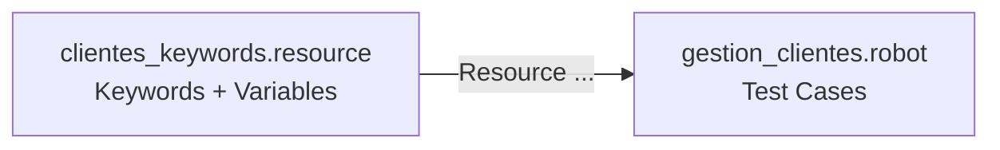

{width=120px}

# Práctica 3: Suite estructurada con keywords reutilizables y archivo Resource

## Metadatos

| Campo            | Detalle                                       |
|------------------|------------------------------------------------|
| **Duración**     | 72 minutos                                      |
| **Complejidad**  | Fácil                                           |
| **Nivel Bloom**  | Aplicar (Apply)                                 |
| **Capítulo**     | 2 — Sintaxis y Diseño de Suites de Prueba       |
| **Versión RF**   | Robot Framework 7.x                             |

---

## Descripción general

Hasta ahora escribiste todo en un solo archivo `.robot`. Cuando un proyecto crece, mezclar keywords y test cases en el mismo archivo se vuelve difícil de mantener. La solución de Robot Framework es el **archivo Resource**: un archivo donde viven las keywords y variables compartidas, que cualquier suite puede importar.

En esta práctica vas a construir una mini gestión de clientes de telecom: un archivo Resource con keywords reutilizables, y una suite que las usa.



```{=typst}
#flujo(("clientes_keywords.resource (Keywords + Variables)", "gestion_clientes.robot (Test Cases)"))
```

---

## Objetivos de aprendizaje

- Crear un archivo `.resource` con keywords y variables reutilizables.
- Importar un Resource en una suite con `Resource`.
- Usar `Create Dictionary` (librería `Collections`) para modelar datos.
- Validar datos compartidos entre varios test cases.

---

## Prerrequisitos

| Área | Nivel |
|---|---|
| Sesión 1 completada (entorno, primer test case) | Requerido |
| Variables escalares (`${...}`) | Básico |

---

## ¿Por qué separar keywords en un Resource?

| Sin Resource | Con Resource |
|---|---|
| Las keywords solo existen en ese archivo | Cualquier suite las puede reutilizar |
| Duplicas lógica si tienes 2 suites parecidas | Un solo lugar para corregir un bug |
| El archivo `.robot` mezcla "qué probar" con "cómo hacerlo" | El test case queda legible: solo describe "qué probar" |

> 💡 **Tip:** un archivo `.resource` puede tener las secciones `Settings`, `Variables` y `Keywords` — pero **no** `Test Cases`. Esa sección es exclusiva de las suites.

---

## Entorno del laboratorio

### Estructura de carpetas

```
robfram-code/
└── sesion-02/
    └── practica-03-resource/
        ├── resources/
        │   └── clientes_keywords.resource
        └── tests/
            └── gestion_clientes.robot
```

---

## Pasos de la práctica

### Paso 1 — Crear el archivo Resource

Crea `resources/clientes_keywords.resource`:

```robot
*** Settings ***
Documentation     Keywords reutilizables para gestión de clientes de telecom.
Library           Collections


*** Variables ***
${PLAN_BASICO}      Básico
${PLAN_PREMIUM}     Premium


*** Keywords ***
Crear Cliente
    [Documentation]    Crea un diccionario que representa un cliente con
    ...                su nombre y el plan contratado.
    [Arguments]    ${nombre}    ${plan}
    ${cliente}=    Create Dictionary    nombre=${nombre}    plan=${plan}
    RETURN    ${cliente}

Validar Plan Asignado
    [Documentation]    Verifica que el plan de un cliente coincide con el
    ...                plan esperado.
    [Arguments]    ${cliente}    ${plan_esperado}
    Should Be Equal    ${cliente}[plan]    ${plan_esperado}
```

**¿Qué es `Library Collections`?** Es una librería nativa de Robot Framework (no necesitas instalarla con `pip`) que agrega keywords para trabajar con listas y diccionarios, como `Create Dictionary`.

**¿Qué hace `RETURN`?** Devuelve un valor desde una keyword, igual que `return` en una función de Python.

---

### Paso 2 — Crear la suite que importa el Resource

Crea `tests/gestion_clientes.robot`:

```robot
*** Settings ***
Documentation     Suite que importa keywords desde un archivo Resource
...               y valida datos usando variables compartidas.
Resource          ../resources/clientes_keywords.resource


*** Test Cases ***
TC-01 Crear cliente con plan básico
    ${cliente}=    Crear Cliente    Ana Pérez    ${PLAN_BASICO}
    Validar Plan Asignado    ${cliente}    ${PLAN_BASICO}

TC-02 Crear cliente con plan premium
    ${cliente}=    Crear Cliente    Luis Gómez    ${PLAN_PREMIUM}
    Validar Plan Asignado    ${cliente}    ${PLAN_PREMIUM}

TC-03 Dos clientes con planes distintos no se confunden entre sí
    ${cliente_a}=    Crear Cliente    María Díaz    ${PLAN_BASICO}
    ${cliente_b}=    Crear Cliente    Carlos Ruiz    ${PLAN_PREMIUM}
    Validar Plan Asignado    ${cliente_a}    ${PLAN_BASICO}
    Validar Plan Asignado    ${cliente_b}    ${PLAN_PREMIUM}
```

Observa que **ni `${PLAN_BASICO}` ni `${PLAN_PREMIUM}` están definidas en esta suite** — vienen del Resource importado. Eso es justamente lo que ganas al separar capas.

---

### Paso 3 — Ejecutar la suite

```bash
robot --outputdir reports tests/gestion_clientes.robot
```

**Salida esperada:** `3 tests, 3 passed, 0 failed`.

---

## Validación y pruebas

```bash
robot --outputdir reports tests/gestion_clientes.robot
```

### Lista de verificación final

| Criterio | Estado |
|---|---|
| `clientes_keywords.resource` creado con 2 keywords y 2 variables | ☐ |
| `gestion_clientes.robot` importa el Resource con `Resource` | ☐ |
| Los 3 test cases pasan | ☐ |

---

## Solución de problemas

### `Resolving variable '${PLAN_BASICO}' failed`

**Causa:** la ruta del `Resource` en `Settings` está mal escrita, o el archivo no se guardó.
**Solución:** confirma que la ruta `../resources/clientes_keywords.resource` es correcta relativa a la ubicación de `tests/gestion_clientes.robot`.

### `No keyword with name 'Crear Cliente' found`

**Causa:** falta la línea `Resource          ../resources/clientes_keywords.resource` en `*** Settings ***`, o tiene un error de tipeo.
**Solución:** revisa que el nombre del archivo coincide exactamente (mayúsculas/minúsculas incluidas en sistemas Linux/macOS).

---

## Resumen

- Un archivo `.resource` centraliza keywords y variables — no tiene `Test Cases`.
- `Resource    <ruta>` en `Settings` lo importa en una suite.
- `Library Collections` agrega keywords para diccionarios y listas (`Create Dictionary`, entre otras).
- Separar capas hace que los test cases describan **qué** se prueba, no **cómo**.

### Próximos pasos

En la **Práctica 4** vas a agregar `Setup`/`Teardown` y a filtrar la ejecución con tags — clave para organizar suites grandes.

### Recursos

| Recurso | URL |
|---|---|
| Resource files (User Guide) | <https://robotframework.org/robotframework/latest/RobotFrameworkUserGuide.html#resource-files> |
| Librería Collections | <https://robotframework.org/robotframework/latest/libraries/Collections.html> |
