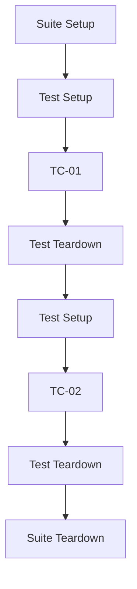

{width=120px}

# Práctica 4: Parametrización con Setup/Teardown y filtrado por tags

## Metadatos

| Campo            | Detalle                                       |
|------------------|------------------------------------------------|
| **Duración**     | 72 minutos                                      |
| **Complejidad**  | Media                                           |
| **Nivel Bloom**  | Aplicar (Apply)                                 |
| **Capítulo**     | 2 — Sintaxis y Diseño de Suites de Prueba       |
| **Versión RF**   | Robot Framework 7.x                             |

---

## Descripción general

Cuando una suite crece, dos problemas aparecen seguido: (1) necesitas preparar/limpiar algo antes y después de los tests, y (2) necesitas ejecutar solo un subconjunto de tests (por ejemplo, solo los críticos antes de un despliegue). Robot Framework resuelve ambos con **Setup/Teardown** y **tags**.



```{=typst}
#flujo-vertical(("Suite Setup (una vez)", "Test Setup -> TC-01 -> Test Teardown", "Test Setup -> TC-02 -> Test Teardown", "Suite Teardown (una vez)"))
```

---

## Objetivos de aprendizaje

- Implementar `Suite Setup` / `Suite Teardown` (se ejecutan una sola vez).
- Implementar `Test Setup` / `Test Teardown` (se ejecutan antes/después de **cada** test).
- Etiquetar test cases con `[Tags]`.
- Ejecutar subconjuntos de tests con `--include` y `--exclude`.

---

## Prerrequisitos

| Área | Nivel |
|---|---|
| Práctica 3 completada (Resource, Collections) | Requerido |

---

## Los cuatro niveles de Setup/Teardown

| Nivel | ¿Cuándo se ejecuta? |
|---|---|
| `Suite Setup` | Una vez, antes del primer test de la suite |
| `Test Setup` | Antes de **cada** test case |
| `Test Teardown` | Después de **cada** test case (incluso si falló) |
| `Suite Teardown` | Una vez, después del último test |

> ⚠️ **Importante:** `Teardown` se ejecuta **aunque el test falle**. Por eso es el lugar correcto para liberar recursos (cerrar navegador, cerrar conexión, borrar archivos temporales) — nunca debes depender de que el test pase para hacer la limpieza.

---

## Entorno del laboratorio

### Estructura de carpetas

```
robfram-code/
└── sesion-02/
    └── practica-04-setup-teardown-tags/
        ├── resources/
        │   └── clientes_keywords.resource
        └── tests/
            └── regresion_clientes.robot
```

---

## Pasos de la práctica

### Paso 1 — Reutilizar el Resource de la Práctica 3

Copia `clientes_keywords.resource` (de la Práctica 3) a `resources/` dentro de esta nueva práctica — cada práctica de este curso es autocontenida, no depende de carpetas de otras prácticas.

### Paso 2 — Escribir la suite con Setup/Teardown y tags

Crea `tests/regresion_clientes.robot`:

```robot
*** Settings ***
Documentation     Suite Setup/Teardown, Test Setup/Teardown y filtrado
...               de tests por tags de inclusión/exclusión.
Resource          ../resources/clientes_keywords.resource
Suite Setup       Log    Iniciando suite de regresión de clientes
Suite Teardown    Log    Finalizando suite de regresión de clientes
Test Setup        Log    Preparando datos para el siguiente test
Test Teardown     Log    Limpieza posterior al test


*** Test Cases ***
TC-01 Cliente premium tiene soporte prioritario
    [Tags]    regresion    premium
    ${cliente}=    Crear Cliente    Luis Gómez    ${PLAN_PREMIUM}
    Validar Plan Asignado    ${cliente}    ${PLAN_PREMIUM}

TC-02 Cliente básico no tiene soporte prioritario
    [Tags]    regresion    basico
    ${cliente}=    Crear Cliente    Ana Pérez    ${PLAN_BASICO}
    Validar Plan Asignado    ${cliente}    ${PLAN_BASICO}

TC-03 El sistema de gestión de clientes responde
    [Tags]    smoke
    ${cliente}=    Crear Cliente    Cliente De Prueba    ${PLAN_BASICO}
    Should Not Be Empty    ${cliente}
```

**Verificación de sintaxis:**

```bash
robot --dryrun tests/regresion_clientes.robot
```

---

### Paso 3 — Ejecutar la suite completa

```bash
robot --outputdir reports tests/regresion_clientes.robot
```

**Salida esperada:** `3 tests, 3 passed, 0 failed`. En `log.html` verás los mensajes de `Suite Setup`/`Suite Teardown` una sola vez, y los de `Test Setup`/`Test Teardown` repetidos antes/después de cada test.

---

### Paso 4 — Ejecutar solo los tests `smoke`

```bash
robot --outputdir reports_smoke --include smoke tests/regresion_clientes.robot
```

**Salida esperada:** `1 test, 1 passed, 0 failed` (solo TC-03).

---

### Paso 5 — Excluir los tests `basico`

```bash
robot --outputdir reports_no_basico --exclude basico tests/regresion_clientes.robot
```

**Salida esperada:** `2 tests, 2 passed, 0 failed` (TC-01 y TC-03, se excluye TC-02).

> 💡 **Tip:** en un pipeline de CI/CD real, normalmente corres `--include smoke` en cada commit (rápido) y la suite completa de `regresion` solo antes de un release — lo verás con más detalle en la Sesión 9.

---

## Validación y pruebas

```bash
robot --outputdir reports tests/regresion_clientes.robot
robot --outputdir reports_smoke --include smoke tests/regresion_clientes.robot
robot --outputdir reports_no_basico --exclude basico tests/regresion_clientes.robot
```

### Lista de verificación final

| Criterio | Estado |
|---|---|
| Ejecución completa: 3/3 PASS | ☐ |
| `--include smoke`: 1/1 PASS | ☐ |
| `--exclude basico`: 2/2 PASS | ☐ |

---

## Solución de problemas

### `--include smoke` no ejecuta ningún test

**Causa:** el tag en `[Tags]` no coincide exactamente (los tags son sensibles a como los escribiste, aunque Robot Framework normaliza mayúsculas/espacios internamente — el error más común es un typo).
**Solución:** revisa con `robot --dryrun` y observa qué tags detecta Robot Framework para cada test.

### El `Test Teardown` no se ejecuta cuando un test falla

Esto **no debería pasar** — `Test Teardown` siempre se ejecuta, incluso ante fallo. Si no lo ves en el log, revisa que esté en la sección `*** Settings ***` (a nivel de suite) y no dentro de un test case individual por error.

---

## Resumen

- `Suite Setup`/`Suite Teardown`: una vez por suite. `Test Setup`/`Test Teardown`: una vez por test, siempre (incluso si falla).
- `[Tags]` etiqueta un test case; se puede tener más de uno.
- `--include TAG` ejecuta solo esos tests; `--exclude TAG` los omite.

### Próximos pasos

En la **Sesión 3** vas a agregar lógica condicional (`IF`/`ELSE`) y bucles (`FOR`) a tus test cases.

### Recursos

| Recurso | URL |
|---|---|
| Setup and Teardown (User Guide) | <https://robotframework.org/robotframework/latest/RobotFrameworkUserGuide.html#setups-and-teardowns> |
| Tagging test cases (User Guide) | <https://robotframework.org/robotframework/latest/RobotFrameworkUserGuide.html#test-case-tags> |
| Including/excluding tests por tags (`--include`/`--exclude`) | <https://robotframework.org/robotframework/latest/RobotFrameworkUserGuide.html#by-tag-names> |
