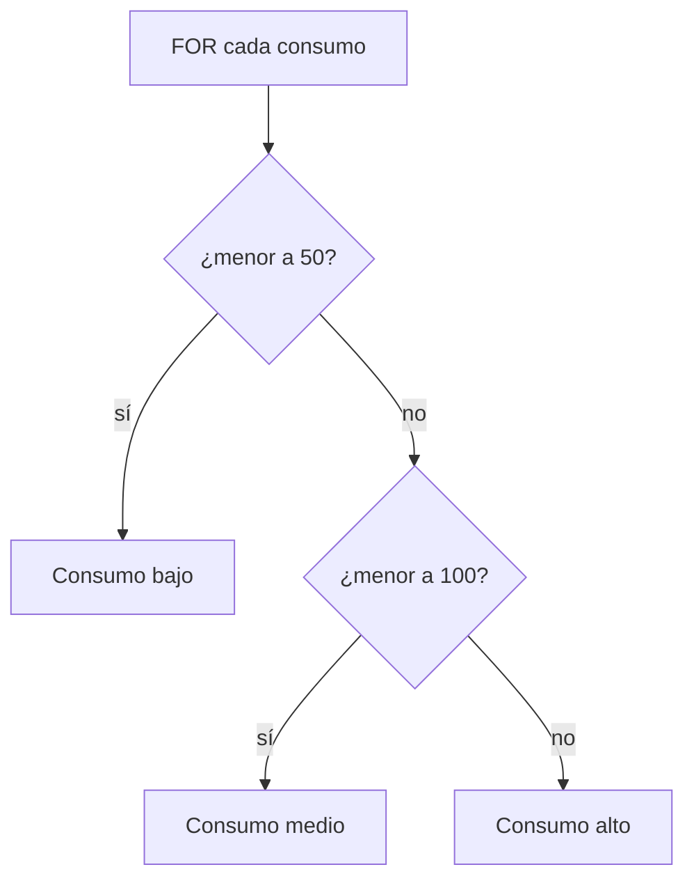

# Práctica 5: Tests con lógica condicional y bucles de datos

## Metadatos

| Campo            | Detalle                                       |
|------------------|------------------------------------------------|
| **Duración**     | 72 minutos                                      |
| **Complejidad**  | Media                                           |
| **Nivel Bloom**  | Aplicar (Apply)                                 |
| **Capítulo**     | 3 — Control de Flujo y Validaciones             |
| **Versión RF**   | Robot Framework 7.x                             |

---

## Descripción general

No todos los datos de prueba son iguales: a veces necesitas decidir qué hacer según un valor (`IF`/`ELSE IF`/`ELSE`), y a veces necesitas repetir una verificación para varios valores (`FOR`). En esta práctica vas a clasificar consumos de datos de clientes telecom y detectar cuáles exceden su límite de plan.



```{=typst}
#flujo-vertical(("FOR cada consumo en la lista", "IF consumo < 50 -> bajo", "ELSE IF consumo < 100 -> medio", "ELSE -> alto"))
```

---

## Objetivos de aprendizaje

- Usar `IF` / `ELSE IF` / `ELSE` para ejecutar lógica condicional.
- Usar `FOR ... IN ... END` para iterar sobre una lista.
- Combinar `FOR` + `IF` para validar colecciones de datos.

---

## Prerrequisitos

| Área | Nivel |
|---|---|
| Sesión 2 completada (`Create Dictionary`, `Create List`) | Requerido |

---

## Sintaxis básica

```robot
IF    ${condicion}
    Log    Se cumple la condición
ELSE IF    ${otra_condicion}
    Log    Se cumple la otra condición
ELSE
    Log    No se cumplió ninguna condición
END
```

```robot
FOR    ${elemento}    IN    @{lista}
    Log    Elemento actual: ${elemento}
END
```

> ⚠️ **Importante:** todo bloque `IF` y todo bloque `FOR` debe cerrarse con `END`. Olvidar el `END` es el error de sintaxis más común en este tema.

---

## Pasos de la práctica

### Paso 1 — Clasificar consumo con IF/ELSE IF/ELSE dentro de un FOR

Crea `tests/validaciones_planes.robot`:

```robot
*** Settings ***
Documentation     Tests con lógica condicional (IF/ELSE IF/ELSE) y bucles
...               (FOR) sobre datos de consumo de clientes telecom.
Library           Collections


*** Variables ***
@{CONSUMOS_GB}    45    72    101    15    99


*** Test Cases ***
TC-01 Clasificar el consumo de cada cliente por rango
    FOR    ${consumo}    IN    @{CONSUMOS_GB}
        Clasificar Consumo    ${consumo}
    END


*** Keywords ***
Clasificar Consumo
    [Arguments]    ${consumo}
    IF    ${consumo} < 50
        Log    ${consumo}GB -> Consumo bajo
    ELSE IF    ${consumo} < 100
        Log    ${consumo}GB -> Consumo medio
    ELSE
        Log    ${consumo}GB -> Consumo alto
    END
```

**¿Por qué la lógica está en una keyword y no directo en el test?** Porque así puedes reutilizar `Clasificar Consumo` en otros tests sin repetir el bloque `IF`.

---

### Paso 2 — Detectar clientes que exceden su límite (FOR + IF anidado)

Agrega este test case al mismo archivo:

```robot
TC-02 Detectar clientes que exceden su límite de plan
    ${cliente_1}=    Create Dictionary    nombre=Ana     limite=${50}    consumo=${45}
    ${cliente_2}=    Create Dictionary    nombre=Luis    limite=${50}    consumo=${72}
    @{clientes}=     Create List    ${cliente_1}    ${cliente_2}

    FOR    ${cliente}    IN    @{clientes}
        IF    ${cliente}[consumo] > ${cliente}[limite]
            Log    ${cliente}[nombre] excede su límite de ${cliente}[limite]GB    WARN
        ELSE
            Log    ${cliente}[nombre] está dentro de su límite
        END
    END
```

**¿Qué hace `${cliente}[consumo]`?** Accede al valor de la clave `consumo` dentro del diccionario `${cliente}` — la misma sintaxis que verías en Python con `cliente["consumo"]`.

**¿Por qué `limite=${50}` y no `limite=50`?** El prefijo `${50}` convierte el texto en un número entero de Python. Sin eso, `limite` sería el string `"50"`, y comparar `${cliente}[consumo] > ${cliente}[limite]` con strings no compara números — compara texto.

---

### Paso 3 — Ejecutar la suite

```bash
robot --outputdir reports tests/validaciones_planes.robot
```

**Salida esperada:** `2 tests, 2 passed, 0 failed`. En `log.html`, TC-02 debe mostrar una advertencia (`WARN`) para Luis, que excede su límite (72GB > 50GB).

---

## Validación y pruebas

```bash
robot --outputdir reports tests/validaciones_planes.robot
```

### Lista de verificación final

| Criterio | Estado |
|---|---|
| TC-01 clasifica los 5 consumos sin error | ☐ |
| TC-02 marca a Luis con `WARN` por exceder su límite | ☐ |
| `2 tests, 2 passed, 0 failed` | ☐ |

---

## Solución de problemas

### `Multiple errors: ... END`

**Causa:** olvidaste cerrar un bloque `IF` o `FOR` con `END`.
**Solución:** revisa que cada `IF`/`FOR` que abriste tenga su `END` correspondiente, en el mismo nivel de indentación que la palabra que lo abrió.

### `TypeError` al comparar `${cliente}[consumo] > ${cliente}[limite]`

**Causa:** alguno de los valores se guardó como texto en vez de número (olvidaste el prefijo `${...}` al definirlo en `Create Dictionary`).
**Solución:** confirma que escribiste `consumo=${45}` y no `consumo=45`.

---

## Resumen

- `IF` / `ELSE IF` / `ELSE` ejecutan lógica condicional; siempre cierran con `END`.
- `FOR ... IN ... END` itera sobre una lista o sobre los valores de un diccionario.
- Combinar `FOR` + `IF` permite validar colecciones completas de datos con una sola keyword.

### Próximos pasos

En la **Práctica 6** vas a aprender a manejar fallas de forma controlada: continuar la ejecución a pesar de un error, o capturar errores esperados sin que el test falle.

### Recursos

| Recurso | URL |
|---|---|
| IF / ELSE (User Guide) | <https://robotframework.org/robotframework/latest/RobotFrameworkUserGuide.html#if-else-syntax> |
| FOR loops (User Guide) | <https://robotframework.org/robotframework/latest/RobotFrameworkUserGuide.html#for-loops> |
