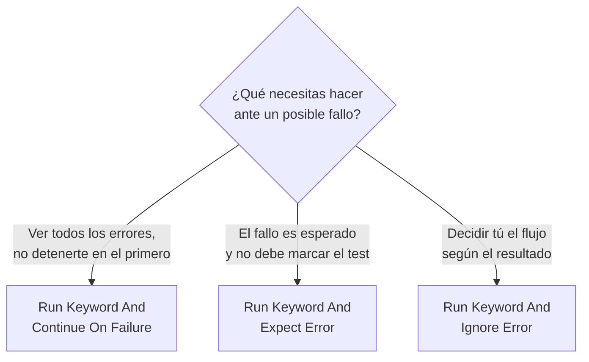

# Práctica 6: Suite robusta con manejo de fallas y recuperación

## Metadatos

| Campo            | Detalle                                       |
|------------------|------------------------------------------------|
| **Duración**     | 72 minutos                                      |
| **Complejidad**  | Media                                           |
| **Nivel Bloom**  | Analizar (Analyze)                              |
| **Capítulo**     | 3 — Control de Flujo y Validaciones             |
| **Versión RF**   | Robot Framework 7.x                             |

---

## Descripción general

Por defecto, Robot Framework usa un modelo **fail fast**: si una keyword falla, el test se detiene ahí mismo. Eso es correcto la mayoría de las veces, pero hay tres situaciones donde necesitas más control:

1. Quieres ver **todos** los errores de un test, no solo el primero.
2. Esperas que algo falle a propósito (por ejemplo, validar que el sistema rechaza datos inválidos) y eso **no** debería marcar tu test como fallido.
3. Quieres decidir tú mismo qué hacer cuando algo falla, sin que el test se detenga.



```{=typst}
#opciones(("Continue On Failure\n(ver todos los errores)", "Expect Error\n(fallo esperado = PASS)", "Ignore Error\n(decides tú el flujo)"))
```

---

## Objetivos de aprendizaje

- Usar `Run Keyword And Continue On Failure` para no detener un test ante un fallo.
- Usar `Run Keyword And Expect Error` para validar errores esperados sin fallar el test.
- Usar `Run Keyword And Ignore Error` para capturar el resultado y decidir el flujo manualmente.

---

## Prerrequisitos

| Área | Nivel |
|---|---|
| Práctica 5 completada (`IF`/`FOR`) | Requerido |

---

## Los tres patrones de esta práctica

| Patrón | ¿Qué hace? | ¿Cuándo usarlo? |
|---|---|---|
| `Run Keyword And Continue On Failure` | Ejecuta la keyword; si falla, **registra el fallo pero sigue** con las siguientes líneas del test | Validar varios campos de un formulario y ver todos los errores juntos |
| `Run Keyword And Expect Error` | Ejecuta la keyword esperando que falle con un mensaje específico; si falla así, el test queda en **PASS** | Probar que el sistema rechaza correctamente una entrada inválida |
| `Run Keyword And Ignore Error` | Ejecuta la keyword y devuelve el estado (`PASS`/`FAIL`) y el mensaje, sin detener nada | Necesitas decidir tú mismo, con `IF`, qué hacer según el resultado |

> 💡 **Importante:** estos tres patrones existen porque Robot Framework no tiene un interruptor general de "no falles nunca" — cada uno resuelve un caso de uso distinto. Mezclarlos sin entender la diferencia genera tests confusos.

---

## Pasos de la práctica

### Paso 1 — Validar varios campos sin detenerte en el primero que falle

Crea `tests/suite_robusta.robot`:

```robot
*** Settings ***
Documentation     Suite que demuestra tres patrones de manejo de fallas.


*** Test Cases ***
TC-01 Validar varios campos sin detenerse en el primer fallo
    [Documentation]    El test SÍ queda en FAIL al final — es intencional:
    ...                el objetivo es ver los 3 mensajes, no evitar el FAIL.
    Run Keyword And Continue On Failure    Should Be Equal    ${1}    ${1}    msg=Campo A
    Run Keyword And Continue On Failure    Should Be Equal    ${1}    ${2}    msg=Campo B (fallo intencional para la demo)
    Run Keyword And Continue On Failure    Should Be Equal    ${3}    ${3}    msg=Campo C
```

**Ejecuta solo este test case** (vas a ver que las tres líneas se ejecutan, aunque la del medio falle):

```bash
robot --outputdir reports --test "TC-01*" tests/suite_robusta.robot
```

**Salida esperada:** el test queda en `FAIL` (porque el Campo B realmente falla), pero en `log.html` ves los tres mensajes — Campo A y Campo C sí se evaluaron, no se detuvo la ejecución en el Campo B.

> ⚠️ **No confundas esto con "el test pasa siempre".** `Continue On Failure` evita que **se detenga**, pero no oculta el fallo: el test sigue marcado como `FAIL` si alguna de las verificaciones falló de verdad.

---

### Paso 2 — Validar que un error esperado no haga fallar el test

Agrega al mismo archivo:

```robot
*** Test Cases ***
TC-02 Capturar un error esperado sin marcar el test como fallido
    Run Keyword And Expect Error    ValueError: *    Convertir A Entero    no-es-numero


*** Keywords ***
Convertir A Entero
    [Arguments]    ${valor}
    ${resultado}=    Convert To Integer    ${valor}
    RETURN    ${resultado}
```

**¿Qué hace el patrón `ValueError: *`?** El `*` es un wildcard: acepta cualquier texto después de `ValueError:`. Así no dependes del mensaje exacto de Python, solo del tipo de error.

```bash
robot --outputdir reports --test "TC-02*" tests/suite_robusta.robot
```

**Salida esperada:** `1 test, 1 passed, 0 failed` — aunque `Convertir A Entero` internamente lanzó un error, el test pasa porque **ese era el error esperado**.

---

### Paso 3 — Decidir el flujo según el resultado, sin detener el test

Agrega:

```robot
*** Test Cases ***
TC-03 Ignorar un error y decidir el flujo según el resultado
    ${estado}    ${mensaje}=    Run Keyword And Ignore Error    Convertir A Entero    abc
    IF    '${estado}' == 'FAIL'
        Log    Conversión falló como se esperaba: ${mensaje}
    ELSE
        Fail    Se esperaba que la conversión fallara y no fue así
    END
```

**¿Por qué `'${estado}' == 'FAIL'` con comillas?** Porque estás comparando texto (el estado que devuelve Robot Framework es el string `'PASS'` o `'FAIL'`), y en una expresión de `IF` las comillas indican que es una comparación de strings, no de variables Python.

---

### Paso 4 — Ejecutar la suite completa

```bash
robot --outputdir reports tests/suite_robusta.robot
```

**Salida esperada:** `3 tests, 2 passed, 1 failed` — TC-01 falla intencionalmente (Paso 1), TC-02 y TC-03 pasan.

---

## Validación y pruebas

```bash
robot --outputdir reports tests/suite_robusta.robot
```

### Lista de verificación final

| Criterio | Estado |
|---|---|
| TC-01: los 3 mensajes (A, B, C) aparecen en `log.html` | ☐ |
| TC-02: pasa al capturar el `ValueError` esperado | ☐ |
| TC-03: pasa al detectar el estado `FAIL` con `Ignore Error` | ☐ |
| Resultado total: `3 tests, 2 passed, 1 failed` | ☐ |

---

## Solución de problemas

### `Run Keyword And Expect Error` falla con "Expected error ... but got ..."

**Causa:** el patrón de error (`ValueError: *`) no coincide con el mensaje real que lanza la keyword.
**Solución:** ejecuta con `--loglevel DEBUG` y revisa el mensaje exacto del error en consola, luego ajusta el patrón.

### TC-03 falla con "Se esperaba que la conversión fallara y no fue así"

**Causa:** el valor que le pasaste a `Convertir A Entero` sí era convertible a número.
**Solución:** confirma que usaste un valor no numérico, como `abc`.

---

## Resumen

- `Run Keyword And Continue On Failure`: sigue ejecutando, pero el test queda en `FAIL` si algo falló de verdad.
- `Run Keyword And Expect Error`: el test pasa si el error ocurrido coincide con el esperado.
- `Run Keyword And Ignore Error`: devuelve `(estado, mensaje)` para que decidas tú el flujo con `IF`.

### Próximos pasos

En la **Sesión 4** vas a aplicar BDD (Given/When/Then) para escribir pruebas en lenguaje de negocio.

### Recursos

| Recurso | URL |
|---|---|
| Run Keyword And Continue On Failure | <https://robotframework.org/robotframework/latest/libraries/BuiltIn.html#Run%20Keyword%20And%20Continue%20On%20Failure> |
| Run Keyword And Expect Error | <https://robotframework.org/robotframework/latest/libraries/BuiltIn.html#Run%20Keyword%20And%20Expect%20Error> |
| Run Keyword And Ignore Error | <https://robotframework.org/robotframework/latest/libraries/BuiltIn.html#Run%20Keyword%20And%20Ignore%20Error> |
