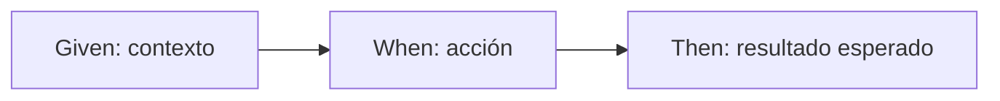

# Práctica 7: Escritura de escenarios BDD para un flujo comercial de telecomunicaciones

## Metadatos

| Campo            | Detalle                                       |
|------------------|------------------------------------------------|
| **Duración**     | 72 minutos                                      |
| **Complejidad**  | Media                                           |
| **Nivel Bloom**  | Aplicar (Apply)                                 |
| **Capítulo**     | 4 — Behavior-Driven Development (BDD)           |
| **Versión RF**   | Robot Framework 7.x                             |

---

## Descripción general

Hasta ahora tus test cases han usado nombres en lenguaje técnico. BDD (*Behavior-Driven Development*) propone escribir el escenario en **lenguaje de negocio**, usando los prefijos `Given` (contexto), `When` (acción) y `Then` (resultado esperado) — el mismo lenguaje que usaría un analista de negocio, sin necesidad de leer código.

En esta práctica vas a traducir un proceso real de telecomunicaciones — la activación de un plan de datos adicional — a un escenario Gherkin funcional.



```{=typst}
#flujo(("Given: contexto", "When: acción", "Then: resultado esperado"))
```

---

## Objetivos de aprendizaje

- Escribir un test case usando los prefijos Gherkin (`Given`/`When`/`Then`).
- Entender que Robot Framework ignora el prefijo al resolver el nombre de la keyword.
- Modelar un flujo de negocio de telecom (activación de servicio) en BDD.

---

## Prerrequisitos

| Área | Nivel |
|---|---|
| Sesión 3 completada (`IF`, `Set Variable`) | Requerido |

---

## ¿Cómo funciona Given/When/Then en Robot Framework?

Robot Framework **no tiene una sintaxis BDD especial** — los prefijos `Given`, `When`, `Then`, `And` y `But` son simples palabras que Robot Framework **elimina automáticamente** antes de buscar la keyword. Es decir, esto:

```robot
Given un cliente con crédito suficiente existe en el sistema
```

Busca exactamente la misma keyword que esto:

```robot
un cliente con crédito suficiente existe en el sistema
```

El prefijo es solo para **legibilidad humana** — para quien lee el test case, no para el motor de ejecución.

---

## Pasos de la práctica

### Paso 1 — Definir las keywords del escenario

Crea `resources/activacion_keywords.resource`:

```robot
*** Settings ***
Documentation     Keywords con sintaxis Gherkin.


*** Keywords ***
un cliente con crédito suficiente existe en el sistema
    Set Test Variable    ${CREDITO_DISPONIBLE}    ${100}

un cliente con crédito insuficiente existe en el sistema
    Set Test Variable    ${CREDITO_DISPONIBLE}    ${0}

el cliente solicita la activación de un plan de datos adicional
    ${costo_plan}=    Set Variable    ${50}
    IF    ${CREDITO_DISPONIBLE} >= ${costo_plan}
        Set Test Variable    ${RESULTADO_ACTIVACION}    ACTIVO
    ELSE
        Set Test Variable    ${RESULTADO_ACTIVACION}    RECHAZADO
    END

el plan queda activo y el cliente recibe una confirmación
    Should Be Equal    ${RESULTADO_ACTIVACION}    ACTIVO

la activación es rechazada y se informa el motivo
    Should Be Equal    ${RESULTADO_ACTIVACION}    RECHAZADO
```

**¿Qué hace `Set Test Variable`?** Crea una variable visible para **todo el test case actual**, sin importar en qué keyword se definió — necesario aquí porque `Given` define `${CREDITO_DISPONIBLE}` y `When`/`Then` la necesitan leer.

---

### Paso 2 — Escribir los dos escenarios

Crea `tests/activacion_servicio.robot`:

```robot
*** Settings ***
Documentation     Escenarios BDD para activación de un plan de datos.
Resource          ../resources/activacion_keywords.resource


*** Test Cases ***
Activación de plan de datos para cliente con crédito suficiente
    Given un cliente con crédito suficiente existe en el sistema
    When el cliente solicita la activación de un plan de datos adicional
    Then el plan queda activo y el cliente recibe una confirmación

Activación rechazada por crédito insuficiente
    Given un cliente con crédito insuficiente existe en el sistema
    When el cliente solicita la activación de un plan de datos adicional
    Then la activación es rechazada y se informa el motivo
```

Observa que cualquier persona del negocio, sin conocer Robot Framework, puede leer estos dos test cases y entender exactamente qué se está probando.

---

### Paso 3 — Ejecutar la suite

```bash
robot --outputdir reports tests/activacion_servicio.robot
```

**Salida esperada:** `2 tests, 2 passed, 0 failed`.

---

## Validación y pruebas

```bash
robot --outputdir reports tests/activacion_servicio.robot
```

### Lista de verificación final

| Criterio | Estado |
|---|---|
| Las keywords usan lenguaje de negocio, no técnico | ☐ |
| Los dos escenarios (crédito suficiente / insuficiente) pasan | ☐ |
| `2 tests, 2 passed, 0 failed` | ☐ |

---

## Solución de problemas

### `No keyword with name 'Given un cliente...' found`

**Causa:** escribiste la keyword en el Resource con un texto distinto al que usaste en el test case (incluso un espacio extra cuenta).
**Solución:** copia el texto exacto del nombre de la keyword del Resource al test case (sin el prefijo Given/When/Then).

---

## Resumen

- `Given`/`When`/`Then`/`And`/`But` son prefijos que Robot Framework ignora al resolver la keyword — son para legibilidad humana.
- `Set Test Variable` comparte una variable entre todas las keywords de un mismo test case.
- BDD permite que un test case sea legible por alguien sin conocimientos técnicos.

### Próximos pasos

En la **Práctica 8** vas a refactorizar un test tradicional hacia BDD, separando explícitamente la capa de negocio de la capa técnica.

### Recursos

| Recurso | URL |
|---|---|
| BDD con Gherkin en RF (User Guide) | <https://robotframework.org/robotframework/latest/RobotFrameworkUserGuide.html#behavior-driven-style> |
