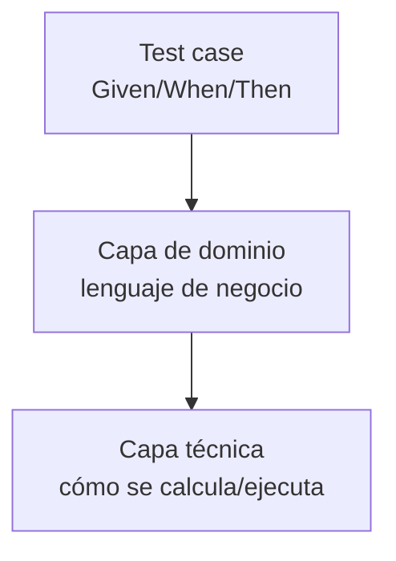

{width=120px}

# Práctica 8: Refactorización de test tradicional a modelo BDD con separación de capas

## Metadatos

| Campo            | Detalle                                       |
|------------------|------------------------------------------------|
| **Duración**     | 72 minutos                                      |
| **Complejidad**  | Media                                           |
| **Nivel Bloom**  | Analizar (Analyze)                              |
| **Capítulo**     | 4 — Behavior-Driven Development (BDD)           |
| **Versión RF**   | Robot Framework 7.x                             |

---

## Descripción general

Escribir Given/When/Then no es suficiente por sí solo: si las keywords mezclan lógica de negocio con detalles técnicos, el escenario sigue siendo difícil de leer. La verdadera ventaja de BDD aparece cuando separas en **capas**: el test case habla en lenguaje de negocio, una capa de **dominio** traduce ese lenguaje a operaciones, y una capa **técnica** implementa el detalle.

En esta práctica vas a tomar un test tradicional (toda la lógica mezclada) y refactorizarlo a este modelo de tres capas.



```{=typst}
#flujo-vertical(("Test case (Given/When/Then)", "Capa de dominio (lenguaje de negocio)", "Capa técnica (cómo se calcula/ejecuta)"))
```

---

## Objetivos de aprendizaje

- Identificar los problemas de mantenibilidad de un test con lógica mezclada.
- Separar una keyword en capa de dominio y capa técnica.
- Refactorizar un test tradicional a BDD sin cambiar su comportamiento.

---

## Prerrequisitos

| Área | Nivel |
|---|---|
| Práctica 7 completada (Given/When/Then) | Requerido |

---

## El problema: lógica mezclada

```robot
*** Test Cases ***
Verificar activacion con credito suficiente
    ${credito}=    Set Variable    ${100}
    ${costo}=      Set Variable    ${50}
    IF    ${credito} >= ${costo}
        ${resultado}=    Set Variable    ACTIVO
    ELSE
        ${resultado}=    Set Variable    RECHAZADO
    END
    Should Be Equal    ${resultado}    ACTIVO
```

Este test **funciona**, pero un analista de negocio no puede leerlo: ve un `IF` con comparaciones numéricas, no una regla de negocio. Y si la regla de cálculo cambia, hay que tocar cada test case que la repite.

---

## Pasos de la práctica

### Paso 1 — Ejecutar la versión original (para tener un punto de referencia)

Guarda el código de arriba como `tests_original/activacion_tradicional.robot` (agrega también un segundo test case para crédito insuficiente) y ejecútalo:

```bash
robot --outputdir reports_original tests_original/activacion_tradicional.robot
```

**Salida esperada:** `2 tests, 2 passed, 0 failed`. Anota este resultado — después de refactorizar, debe seguir siendo idéntico.

---

### Paso 2 — Crear la capa técnica

La capa técnica contiene el **cómo**: el detalle de cálculo, sin nombres de negocio.

Crea `resources/tecnica_keywords.resource`:

```robot
*** Settings ***
Documentation     Capa TÉCNICA: el detalle de cómo se calcula el resultado.


*** Keywords ***
Calcular Resultado De Activacion
    [Arguments]    ${credito}    ${costo}
    IF    ${credito} >= ${costo}
        RETURN    ACTIVO
    ELSE
        RETURN    RECHAZADO
    END
```

---

### Paso 3 — Crear la capa de dominio

La capa de dominio contiene el **qué**, en lenguaje de negocio, y es la única que llama a la capa técnica.

Crea `resources/dominio_keywords.resource`:

```robot
*** Settings ***
Documentation     Capa de DOMINIO: traduce el lenguaje de negocio a la
...               capa técnica. Es la única capa que el test case conoce.
Resource          tecnica_keywords.resource


*** Keywords ***
un cliente con crédito suficiente solicita activar un plan
    ${resultado}=    Calcular Resultado De Activacion    ${100}    ${50}
    Set Test Variable    ${RESULTADO}    ${resultado}

un cliente con crédito insuficiente solicita activar un plan
    ${resultado}=    Calcular Resultado De Activacion    ${0}    ${50}
    Set Test Variable    ${RESULTADO}    ${resultado}

el plan queda activo
    Should Be Equal    ${RESULTADO}    ACTIVO

la activación es rechazada
    Should Be Equal    ${RESULTADO}    RECHAZADO
```

---

### Paso 4 — Escribir el test case refactorizado

Crea `tests/activacion_bdd.robot`:

```robot
*** Settings ***
Documentation     VERSIÓN DESPUÉS: el test case solo conoce lenguaje de
...               negocio (capa de dominio); la capa técnica queda oculta.
Resource          ../resources/dominio_keywords.resource


*** Test Cases ***
Activación de plan con crédito suficiente
    Given un cliente con crédito suficiente solicita activar un plan
    Then el plan queda activo

Activación rechazada por crédito insuficiente
    Given un cliente con crédito insuficiente solicita activar un plan
    Then la activación es rechazada
```

**¿Por qué este escenario no usa `When`?** Porque la keyword de dominio (`un cliente ... solicita activar un plan`) ya combina el contexto y la acción en un solo paso. Esto es válido en Gherkin: `When` no es obligatorio, solo recomendado cuando el contexto y la acción se describen mejor en pasos separados — como hiciste en la Práctica 7. Aquí usar solo `Given`/`Then` es una decisión de redacción, no un error.

**Compara con la versión original:** el test case ya no tiene ningún `IF`, ningún número — solo lenguaje de negocio. La lógica de cálculo sigue existiendo, pero vive en la capa técnica, oculta detrás de la capa de dominio.

---

### Paso 5 — Ejecutar y comparar resultados

```bash
robot --outputdir reports tests/activacion_bdd.robot
```

**Salida esperada:** `2 tests, 2 passed, 0 failed` — exactamente el mismo resultado que la versión original del Paso 1. Refactorizar **no debe cambiar el comportamiento**, solo la estructura.

---

## Validación y pruebas

```bash
robot --outputdir reports_original tests_original/activacion_tradicional.robot
robot --outputdir reports tests/activacion_bdd.robot
```

### Lista de verificación final

| Criterio | Estado |
|---|---|
| Versión original: `2 tests, 2 passed, 0 failed` | ☐ |
| Versión BDD: `2 tests, 2 passed, 0 failed` (mismo resultado) | ☐ |
| El test case BDD no contiene ningún `IF` ni número | ☐ |
| La capa técnica (`Calcular Resultado De Activacion`) solo la usa la capa de dominio | ☐ |

---

## Solución de problemas

### Después de refactorizar, el resultado cambió

**Causa:** lo más probable es que la capa de dominio no esté pasando los mismos valores (`credito`, `costo`) que tenía la versión original.
**Solución:** compara línea por línea los valores usados en `tests_original/` contra los que pasa cada keyword de dominio en `resources/dominio_keywords.resource`.

---

## Resumen

- Separar en capas (técnica → dominio → test case) hace que cada nivel hable el idioma de quien lo necesita leer.
- Refactorizar a BDD **no cambia el comportamiento** del test, solo su estructura — por eso siempre comparas el resultado antes y después.
- Solo la capa de dominio debería llamar directamente a la capa técnica; el test case nunca debería saltarse capas.

### Próximos pasos

En la **Sesión 5** vas a aplicar estos mismos principios de separación por capas a keywords reutilizables más generales, y vas a empezar a extender Robot Framework con Python.

### Recursos

| Recurso | URL |
|---|---|
| BDD con Gherkin en RF (User Guide) | <https://robotframework.org/robotframework/latest/RobotFrameworkUserGuide.html#behavior-driven-style> |
