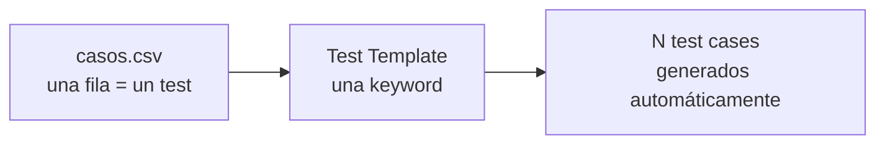

{width=120px}

# Práctica 9: Suite data-driven con CSV y segmentación por tags

## Metadatos

| Campo            | Detalle                                       |
|------------------|------------------------------------------------|
| **Duración**     | 72 minutos                                      |
| **Complejidad**  | Media                                           |
| **Nivel Bloom**  | Aplicar (Apply)                                 |
| **Capítulo**     | 5 — RF Avanzado, Data-Driven y Extensión con Python |
| **Versión RF**   | Robot Framework 7.x                             |

---

## Descripción general

Cuando la misma lógica de prueba debe validarse con muchas combinaciones de datos, escribir un test case por combinación no escala. **DataDriver** es una librería (no nativa, se instala con `pip`) que genera un test case por cada fila de un archivo CSV externo, usando una sola keyword "plantilla".



```{=typst}
#flujo(("CSV (una fila = un test)", "Test Template (una keyword)", "N test cases generados"))
```

---

## Objetivos de aprendizaje

- Instalar y configurar `robotframework-datadriver`.
- Diseñar un archivo CSV compatible con DataDriver (columnas, tags).
- Usar `Test Template` para generar tests desde datos externos.
- Interpretar la segmentación por tags en `report.html`.

---

## Prerrequisitos

| Área | Nivel |
|---|---|
| Sesión 2 completada (tags) | Requerido |
| Sesión 3 completada (`IF`) | Requerido |

---

## Pasos de la práctica

### Paso 1 — Instalar DataDriver

```bash
pip install robotframework-datadriver
```

---

### Paso 2 — Crear el archivo CSV de casos

Crea `data/casos_activacion.csv`. La primera columna siempre se llama `*** Test Cases ***`; las columnas de datos llevan el mismo nombre que los argumentos de la keyword plantilla (con `${...}`); `[Tags]` es una columna especial:

```csv
*** Test Cases ***,${credito},${costo},${resultado_esperado},[Tags]
Cliente con crédito suficiente en staging,100,50,ACTIVO,"ambiente:staging,prioridad:alta"
Cliente sin crédito en staging,0,50,RECHAZADO,"ambiente:staging,prioridad:media"
Cliente con crédito suficiente en produccion,200,150,ACTIVO,"ambiente:produccion,prioridad:alta"
Cliente con crédito insuficiente en produccion,30,50,RECHAZADO,"ambiente:produccion,prioridad:baja"
```

> 💡 **Tip:** dentro de una celda, varios tags se separan con coma, y la celda completa debe ir entre comillas dobles si contiene una coma (`"ambiente:staging,prioridad:alta"`).

---

### Paso 3 — Crear la suite con Test Template

Crea `tests/activacion_data_driven.robot`:

```robot
*** Settings ***
Documentation     Suite data-driven con DataDriver, segmentada por tags
...               de ambiente y prioridad.
Library           DataDriver    ${CURDIR}/../data/casos_activacion.csv    dialect=excel    encoding=utf_8
Test Template     Verificar Resultado De Activacion


*** Test Cases ***
Caso de Ejemplo De Activación


*** Keywords ***
Verificar Resultado De Activacion
    [Arguments]    ${credito}    ${costo}    ${resultado_esperado}
    ${resultado}=    Calcular Resultado De Activacion    ${credito}    ${costo}
    Should Be Equal    ${resultado}    ${resultado_esperado}

Calcular Resultado De Activacion
    [Arguments]    ${credito}    ${costo}
    ${credito_num}=    Convert To Integer    ${credito}
    ${costo_num}=      Convert To Integer    ${costo}
    IF    ${credito_num} >= ${costo_num}
        RETURN    ACTIVO
    ELSE
        RETURN    RECHAZADO
    END
```

> ⚠️ **`dialect=excel` y `encoding=utf_8` son obligatorios aquí.** El valor por defecto de DataDriver es `dialect='Excel-EU'` (separador `;`) y `encoding='cp1252'`. Si tu CSV usa comas (lo más común) y tiene tildes/ñ, **debes** especificar ambos parámetros explícitamente, o obtendrás errores de argumentos faltantes o texto con caracteres corruptos (`crédito` en vez de `crédito`).

**¿Por qué la suite solo tiene un test case (`Caso de Ejemplo De Activación`), sin argumentos?** Porque ese test case es solo una plantilla — DataDriver lo reemplaza dinámicamente con un test case por cada fila del CSV. El nombre real que verás en el reporte es el de la primera columna de cada fila (`Cliente con crédito suficiente en staging`, etc.).

---

### Paso 4 — Ejecutar la suite

```bash
robot --outputdir reports tests/activacion_data_driven.robot
```

**Salida esperada:** `4 tests, 4 passed, 0 failed` — DataDriver generó 4 test cases, uno por fila del CSV.

---

### Paso 5 — Ver la segmentación por tags en el reporte

Abre `reports/report.html` y busca la sección de estadísticas **"By Tag"**. Vas a ver el conteo de pasados/fallados agrupado por `ambiente:staging`, `ambiente:produccion`, `prioridad:alta`, `prioridad:media` y `prioridad:baja` — sin que hayas escrito ningún código adicional para generarlo.

> ⚠️ **Limitación importante de DataDriver con `--include`/`--exclude`:** el filtrado de Robot Framework por línea de comandos (que aprendiste en la Sesión 2) ocurre **antes** de que DataDriver genere los tests reales, sobre el test case plantilla — que no tiene tags propios. Por eso `--include ambiente:produccion` normalmente falla con "no tests matching tag". La forma correcta de filtrar con DataDriver es usando sus propios parámetros (`Library DataDriver ... include=ambiente:produccion`) en vez del flag de CLI. Para esta práctica, usamos la segmentación de `report.html` — que sí funciona sin configuración adicional — en vez de pelear contra esa limitación documentada.

---

## Validación y pruebas

```bash
robot --outputdir reports tests/activacion_data_driven.robot
```

### Lista de verificación final

| Criterio | Estado |
|---|---|
| DataDriver instalado (`pip show robotframework-datadriver`) | ☐ |
| 4 test cases generados desde el CSV (no solo el de plantilla) | ☐ |
| `4 tests, 4 passed, 0 failed` | ☐ |
| `report.html` muestra estadísticas "By Tag" con los 5 tags | ☐ |

---

## Solución de problemas

### `ValueError: Unassigned requiered argument detected: ${credito}`

**Causa:** el dialecto del CSV no coincide con tu archivo (este es el error que vas a reproducir si omites `dialect=excel`).
**Solución:** agrega `dialect=excel` en la línea `Library DataDriver`.

### Aparecen caracteres como `crédito` en los nombres de los tests

**Causa:** encoding incorrecto (DataDriver usa `cp1252` por defecto).
**Solución:** agrega `encoding=utf_8` en la línea `Library DataDriver`.

---

## Resumen

- DataDriver genera un test case por fila de un CSV, a partir de una keyword `Test Template`.
- El nombre de columna debe coincidir con el del argumento (`${credito}` ↔ `${credito}`).
- `dialect` y `encoding` casi siempre necesitan configurarse explícitamente — los valores por defecto son europeos (`Excel-EU`, `cp1252`).
- `--include`/`--exclude` por CLI tiene una limitación documentada con DataDriver; usa la segmentación de `report.html` o los parámetros propios de la librería.

### Próximos pasos

En la **Práctica 10** vas a crear tu propia librería de keywords en Python — el mecanismo de extensión definitivo de Robot Framework.

### Recursos

| Recurso | URL |
|---|---|
| robotframework-datadriver (PyPI) | <https://pypi.org/project/robotframework-datadriver/> |
| Documentación completa de DataDriver | <https://github.com/Snooz82/robotframework-datadriver> |
