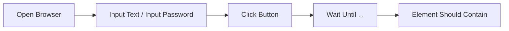

{width=120px}

# Práctica 11: Automatización de flujo de login y navegación E2E

## Metadatos

| Campo            | Detalle                                       |
|------------------|------------------------------------------------|
| **Duración**     | 72 minutos                                      |
| **Complejidad**  | Media                                           |
| **Nivel Bloom**  | Aplicar (Apply)                                 |
| **Capítulo**     | 6 — Automatización Web con SeleniumLibrary      |
| **Versión RF**   | Robot Framework 7.x                             |

---

## Descripción general

En esta práctica vas a automatizar un flujo de autenticación completo en un navegador real (Chrome, en modo headless), usando `SeleniumLibrary`: localizadores CSS, esperas explícitas (nunca `Sleep`), y captura de pantalla automática cuando un test falla.

El sitio que vas a automatizar es **the-internet** (`the-internet.herokuapp.com`), un sitio público diseñado específicamente para practicar automatización — estable y gratuito.



```{=typst}
#flujo(("Open Browser", "Input Text / Password", "Click Button", "Wait Until...", "Element Should Contain"))
```

---

## Objetivos de aprendizaje

- Abrir un navegador headless y navegar con `SeleniumLibrary`.
- Usar localizadores CSS (`id:`, `css:`).
- Usar esperas explícitas (`Wait Until Element Is Visible`, `Wait Until Location Contains`).
- Capturar pantalla automáticamente solo cuando un test falla.
- Entender por qué cada test debe abrir su **propio** navegador (independencia de tests).

---

## Prerrequisitos

| Área | Nivel |
|---|---|
| Sesión 2 completada (`Test Setup`/`Teardown`) | Requerido |
| `pip install robotframework-seleniumlibrary` | Requerido |
| Google Chrome o Chromium instalado | Requerido |

---

## Pasos de la práctica

### Paso 1 — Instalar SeleniumLibrary

```bash
pip install robotframework-seleniumlibrary
```

Selenium 4.6+ incluye **Selenium Manager**, que descarga automáticamente el driver del navegador correcto — no necesitas instalar `chromedriver` por separado.

---

### Paso 2 — Escribir la suite con Test Setup/Teardown por test

Crea `tests/login_e2e.robot`:

```robot
*** Settings ***
Documentation     Flujo completo de autenticación y navegación E2E.
Library           SeleniumLibrary
Test Setup        Open Browser    ${URL_LOGIN}    headlesschrome
Test Teardown     Close All Browsers


*** Variables ***
${URL_LOGIN}              https://the-internet.herokuapp.com/login
${CAMPO_USUARIO}          id:username
${CAMPO_PASSWORD}         id:password
${BOTON_INGRESAR}         css:button[type='submit']
${MENSAJE_FLASH}          css:#flash
${BOTON_CERRAR_SESION}    css:a.button.secondary
${USUARIO_VALIDO}         tomsmith
${PASSWORD_VALIDO}        SuperSecretPassword!


*** Test Cases ***
TC-01 Iniciar sesión con credenciales válidas
    Go To    ${URL_LOGIN}
    Wait Until Element Is Visible    ${CAMPO_USUARIO}    timeout=10s
    Input Text          ${CAMPO_USUARIO}      ${USUARIO_VALIDO}
    Input Password      ${CAMPO_PASSWORD}     ${PASSWORD_VALIDO}
    Click Button    ${BOTON_INGRESAR}
    Wait Until Location Contains    /secure    timeout=10s
    Wait Until Element Is Visible    ${MENSAJE_FLASH}    timeout=10s
    Element Should Contain    ${MENSAJE_FLASH}    You logged into a secure area

TC-02 Rechazar credenciales inválidas con captura de pantalla en fallo
    [Teardown]    Run Keywords
    ...    Run Keyword If Test Failed    Capture Page Screenshot
    ...    AND    Close All Browsers
    Go To    ${URL_LOGIN}
    Input Text          ${CAMPO_USUARIO}      usuario_invalido
    Input Password      ${CAMPO_PASSWORD}     clave_invalida
    Click Button    ${BOTON_INGRESAR}
    Wait Until Element Is Visible    ${MENSAJE_FLASH}    timeout=10s
    Element Should Contain    ${MENSAJE_FLASH}    Your username is invalid!

TC-03 Navegar al área segura y cerrar sesión
    Go To    ${URL_LOGIN}
    Input Text          ${CAMPO_USUARIO}      ${USUARIO_VALIDO}
    Input Password      ${CAMPO_PASSWORD}     ${PASSWORD_VALIDO}
    Click Button    ${BOTON_INGRESAR}
    Wait Until Location Contains    /secure    timeout=10s
    Click Element    ${BOTON_CERRAR_SESION}
    Wait Until Element Is Visible    ${MENSAJE_FLASH}    timeout=10s
    Element Should Contain    ${MENSAJE_FLASH}    You logged out of the secure area!
```

> ⚠️ **Por qué `Test Setup`/`Teardown` y no `Suite Setup`/`Teardown` con un solo navegador compartido:** si abres el navegador una sola vez para los 3 tests (`Suite Setup`), la sesión autenticada de TC-01 **contamina** TC-02 y TC-03 — descubrirás (si lo intentas) que los campos del formulario dejan de comportarse de forma predecible porque el sitio ya tiene una sesión activa de un login anterior. **Cada test debe ser independiente**: abre y cierra su propio navegador. Esta es una de las causas más comunes de tests "flaky" (inestables) en automatización web real.

---

### Paso 3 — Ejecutar la suite

```bash
robot --outputdir reports tests/login_e2e.robot
```

**Salida esperada:** `3 tests, 3 passed, 0 failed`.

---

## Validación y pruebas

```bash
robot --outputdir reports tests/login_e2e.robot
```

Ejecuta la suite **2 o 3 veces seguidas** — debe pasar de forma consistente. Si alguna vez ves un fallo intermitente, revisa primero si compartiste el navegador entre tests.

### Lista de verificación final

| Criterio | Estado |
|---|---|
| `3 tests, 3 passed, 0 failed`, consistente en varias ejecuciones | ☐ |
| Cada test abre y cierra su propio navegador | ☐ |
| TC-02 captura pantalla solo si falla (revisa que NO se generó si pasó) | ☐ |

---

## Solución de problemas

### Los campos del formulario aparecen vacíos en el screenshot de fallo, aunque escribiste texto

**Causa:** casi siempre es contaminación de sesión entre tests — comparte el navegador y un login anterior interfiere con el siguiente.
**Solución:** usa `Test Setup`/`Test Teardown` (un navegador por test), no `Suite Setup`/`Teardown`.

### `WebDriverException: unknown error: net::ERR_NAME_NOT_RESOLVED`

**Causa:** no hay conexión a internet, o el sitio está temporalmente caído.
**Solución:** verifica tu conexión; reintenta en unos minutos.

---

## Resumen

- `Open Browser`/`Close Browser` abren y cierran una sesión de navegador.
- Las esperas explícitas (`Wait Until ...`) son siempre preferibles a `Sleep`.
- Compartir un navegador entre tests independientes es una causa común de tests inestables — usa `Test Setup`/`Teardown`, no `Suite Setup`/`Teardown`, salvo que el comportamiento compartido sea intencional.
- `Run Keyword If Test Failed` + `Capture Page Screenshot` captura evidencia solo cuando falla.

### Próximos pasos

En la **Práctica 12** vas a estructurar esta misma lógica bajo el patrón **Page Object**, capturando evidencias en cada test (no solo en fallo) y manejando alertas de JavaScript.

### Recursos

| Recurso | URL |
|---|---|
| SeleniumLibrary (documentación) | <https://robotframework.org/SeleniumLibrary/SeleniumLibrary.html> |
| the-internet (sitio de práctica) | <https://the-internet.herokuapp.com/> |
