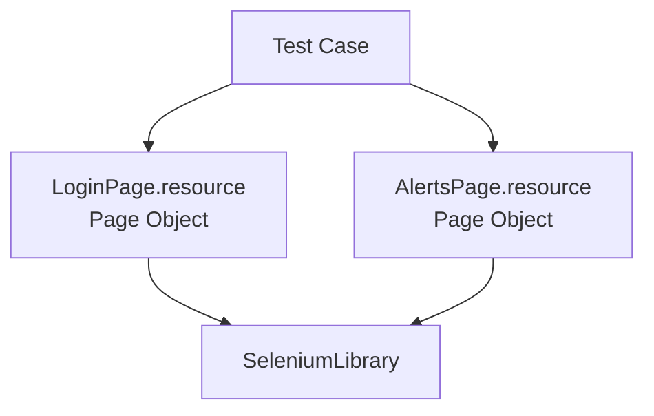

# Práctica 12: Suite web con Page Object y captura de evidencias completas

## Metadatos

| Campo            | Detalle                                       |
|------------------|------------------------------------------------|
| **Duración**     | 72 minutos                                      |
| **Complejidad**  | Media                                           |
| **Nivel Bloom**  | Crear (Create)                                  |
| **Capítulo**     | 6 — Automatización Web con SeleniumLibrary      |
| **Versión RF**   | Robot Framework 7.x                             |

---

## Descripción general

El patrón **Page Object** propone que cada pantalla de la aplicación tenga su propia representación en código: un archivo Resource con los localizadores (como variables) y las keywords de interacción de esa pantalla. El test case nunca ve un selector CSS/XPath directamente — solo llama keywords con nombres de negocio.

En esta práctica vas a estructurar dos páginas como Page Objects, capturar evidencia en **cada** test (no solo en fallo), y manejar una alerta nativa de JavaScript.



```{=typst}
#flujo-vertical(("Test Case", "LoginPage.resource / AlertsPage.resource (Page Object)", "SeleniumLibrary"))
```

---

## Objetivos de aprendizaje

- Estructurar una página como Page Object (locators + keywords en un Resource).
- Capturar evidencia (screenshot) en cada test, no solo en fallo.
- Manejar una alerta nativa de JavaScript con `Handle Alert`.

---

## Prerrequisitos

| Área | Nivel |
|---|---|
| Práctica 11 completada | Requerido |

---

## Pasos de la práctica

### Paso 1 — Crear el Page Object de Login

Crea `resources/LoginPage.resource`:

```robot
*** Settings ***
Documentation     Page Object de la página de login.
Library           SeleniumLibrary


*** Variables ***
${URL_LOGIN}              https://the-internet.herokuapp.com/login
${CAMPO_USUARIO}          id:username
${CAMPO_PASSWORD}         id:password
${BOTON_INGRESAR}         css:button[type='submit']
${MENSAJE_FLASH}          css:#flash


*** Keywords ***
Abrir Pagina De Login
    Go To    ${URL_LOGIN}
    Wait Until Element Is Visible    ${CAMPO_USUARIO}    timeout=10s

Ingresar Credenciales
    [Arguments]    ${usuario}    ${password}
    Input Text          ${CAMPO_USUARIO}      ${usuario}
    Input Password      ${CAMPO_PASSWORD}     ${password}

Hacer Clic En Ingresar
    Click Button    ${BOTON_INGRESAR}

Verificar Mensaje Flash Contiene
    [Arguments]    ${texto_esperado}
    Wait Until Element Is Visible    ${MENSAJE_FLASH}    timeout=10s
    Element Should Contain    ${MENSAJE_FLASH}    ${texto_esperado}
```

Observa que **ningún selector aparece fuera de este archivo** — es la única "fuente de verdad" sobre cómo interactuar con esta página.

---

### Paso 2 — Crear el Page Object de Alertas

Crea `resources/AlertsPage.resource`:

```robot
*** Settings ***
Documentation     Page Object de la página de alertas JS.
Library           SeleniumLibrary


*** Variables ***
${URL_ALERTAS}            https://the-internet.herokuapp.com/javascript_alerts
${BOTON_JS_ALERT}         css:button[onclick='jsAlert()']
${BOTON_JS_CONFIRM}       css:button[onclick='jsConfirm()']
${RESULTADO_ALERTA}       id:result


*** Keywords ***
Abrir Pagina De Alertas
    Go To    ${URL_ALERTAS}
    Wait Until Element Is Visible    ${BOTON_JS_ALERT}    timeout=10s

Disparar Alerta Simple Y Aceptar
    Click Element    ${BOTON_JS_ALERT}
    Handle Alert    action=ACCEPT

Disparar Confirmacion Y Cancelar
    Click Element    ${BOTON_JS_CONFIRM}
    Handle Alert    action=DISMISS

Verificar Resultado Contiene
    [Arguments]    ${texto_esperado}
    Element Should Contain    ${RESULTADO_ALERTA}    ${texto_esperado}
```

**¿Por qué `Handle Alert` y no `Click Element`?** Una alerta de JavaScript (`alert()`, `confirm()`, `prompt()`) **no es un elemento del DOM** — es una ventana nativa del navegador, fuera del árbol HTML. `SeleniumLibrary` necesita una keyword especial (`Handle Alert`) para aceptarla (`ACCEPT`) o cancelarla (`DISMISS`).

---

### Paso 3 — Escribir la suite que solo usa los Page Objects

Crea `tests/web_page_object_suite.robot`:

```robot
*** Settings ***
Documentation     Suite estructurada bajo patrón Page Object, con captura
...               de evidencias en cada test y manejo de alertas JS.
Library           SeleniumLibrary
Resource          ../resources/LoginPage.resource
Resource          ../resources/AlertsPage.resource
Test Setup        Open Browser    about:blank    headlesschrome
Test Teardown     Run Keywords
...               Capture Page Screenshot
...               AND    Close All Browsers


*** Test Cases ***
TC-01 Iniciar sesión exitosamente usando el Page Object
    Abrir Pagina De Login
    Ingresar Credenciales    tomsmith    SuperSecretPassword!
    Hacer Clic En Ingresar
    Verificar Mensaje Flash Contiene    You logged into a secure area

TC-02 Rechazar credenciales inválidas usando el Page Object
    Abrir Pagina De Login
    Ingresar Credenciales    usuario_invalido    clave_invalida
    Hacer Clic En Ingresar
    Verificar Mensaje Flash Contiene    Your username is invalid!

TC-03 Aceptar una alerta simple de JavaScript
    Abrir Pagina De Alertas
    Disparar Alerta Simple Y Aceptar
    Verificar Resultado Contiene    You successfully clicked an alert

TC-04 Cancelar una confirmación de JavaScript
    Abrir Pagina De Alertas
    Disparar Confirmacion Y Cancelar
    Verificar Resultado Contiene    You clicked: Cancel
```

Observa que **el test case nunca menciona un selector CSS** — solo nombres de keywords en lenguaje de negocio, igual que aprendiste con BDD en el Capítulo 4. El patrón Page Object es, en esencia, una capa de dominio especializada en pantallas web.

---

### Paso 4 — Ejecutar y revisar la evidencia

```bash
robot --outputdir reports tests/web_page_object_suite.robot
```

**Salida esperada:** `4 tests, 4 passed, 0 failed`. Revisa la carpeta `reports/` — debe haber **4 archivos** `selenium-screenshot-N.png`, uno por test (a diferencia de la Práctica 11, donde solo se capturaba en fallo).

---

## Validación y pruebas

```bash
robot --outputdir reports tests/web_page_object_suite.robot
ls reports/*.png
```

### Lista de verificación final

| Criterio | Estado |
|---|---|
| `4 tests, 4 passed, 0 failed` | ☐ |
| 4 capturas de pantalla generadas (una por test) | ☐ |
| Ningún selector CSS/XPath aparece en `tests/web_page_object_suite.robot` | ☐ |
| El test de la alerta confirma el mensaje correcto | ☐ |

---

## Solución de problemas

### `UnexpectedAlertPresentException`

**Causa:** una alerta de JavaScript quedó abierta de un test anterior y bloquea la siguiente acción de Selenium.
**Solución:** confirma que cada test que dispara una alerta también la maneja con `Handle Alert` antes de terminar; con `Test Setup`/`Teardown` por test (como en esta práctica), cada test arranca con un navegador limpio.

---

## Resumen

- Page Object = localizadores + keywords de una pantalla, en un Resource dedicado.
- El test case solo conoce keywords de negocio — nunca selectores.
- Capturar evidencia en cada test (no solo en fallo) es útil para auditorías o reportes de regresión completos.
- `Handle Alert` maneja alertas nativas de JavaScript, que no son parte del DOM.

### Próximos pasos

En la **Sesión 7** vas a automatizar APIs REST con `RequestsLibrary` — sin navegador, directamente sobre HTTP.

### Recursos

| Recurso | URL |
|---|---|
| SeleniumLibrary — Handle Alert | <https://robotframework.org/SeleniumLibrary/SeleniumLibrary.html#Handle%20Alert> |
| Patrón Page Object (referencia general) | <https://www.selenium.dev/documentation/test_practices/encouraged/page_object_models/> |
