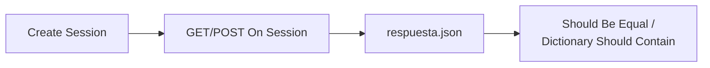

{width=120px}

# Práctica 13: Suite de pruebas API con autenticación Bearer y validación JSON

## Metadatos

| Campo            | Detalle                                       |
|------------------|------------------------------------------------|
| **Duración**     | 72 minutos                                      |
| **Complejidad**  | Media                                           |
| **Nivel Bloom**  | Aplicar (Apply)                                 |
| **Capítulo**     | 7 — Automatización de APIs con RequestsLibrary  |
| **Versión RF**   | Robot Framework 7.x                             |

---

## Descripción general

En esta práctica vas a probar una API REST sin usar ningún navegador — directamente sobre HTTP, con `RequestsLibrary`. Vas a enviar un header de autenticación `Authorization: Bearer <token>`, enviar un payload JSON con `POST`, y validar la estructura de las respuestas.

Para esta práctica usamos **postman-echo.com**, un servicio público gratuito mantenido por Postman que **devuelve exactamente lo que le envías** (headers, body, query params) — perfecto para practicar sin depender de credenciales reales ni de un backend propio.



```{=typst}
#flujo(("Create Session", "GET/POST On Session", "respuesta.json()", "Should Be Equal / Dictionary Should Contain"))
```

---

## Objetivos de aprendizaje

- Crear una sesión HTTP reutilizable con `Create Session`.
- Enviar un header `Authorization: Bearer <token>`.
- Enviar un payload JSON con `POST On Session`.
- Validar estructura y valores de una respuesta JSON.

---

## Prerrequisitos

| Área | Nivel |
|---|---|
| Conceptos HTTP básicos (GET, POST, status codes) | Básico |
| `pip install robotframework-requests` | Requerido |

---

## Pasos de la práctica

### Paso 1 — Instalar RequestsLibrary

```bash
pip install robotframework-requests
```

---

### Paso 2 — Crear la sesión y probar el header Bearer

Crea `tests/api_bearer_suite.robot`:

```robot
*** Settings ***
Documentation     Suite de pruebas API con autenticación Bearer y
...               validación de estructura/valores de respuesta JSON.
Library           RequestsLibrary
Library           Collections
Suite Setup       Create Session    api    https://postman-echo.com    verify=True


*** Variables ***
${TOKEN_DEMO}    token-demo-12345


*** Test Cases ***
TC-01 Autenticar con Bearer token y validar que el servidor lo recibió
    &{headers}=    Create Dictionary    Authorization=Bearer ${TOKEN_DEMO}
    ${respuesta}=    GET On Session    api    /headers    headers=&{headers}
    Should Be Equal As Numbers    ${respuesta.status_code}    200
    Should Be Equal    ${respuesta.json()}[headers][authorization]    Bearer ${TOKEN_DEMO}
```

**¿Qué hace `Create Session`?** Crea una sesión HTTP reutilizable identificada por un alias (`api`); evita repetir la URL base en cada llamada y mantiene cookies/headers persistentes entre peticiones si los necesitas.

**¿Por qué `postman-echo.com/headers` y no un endpoint "protegido" real?** Porque refleja en su respuesta **todos** los headers que recibió — incluido `Authorization` — permitiéndote verificar que el header se construyó y envió correctamente, sin depender de un servicio de autenticación real que pueda cambiar sus credenciales.

---

### Paso 3 — Enviar un payload JSON con POST

Agrega:

```robot
TC-02 Enviar payload JSON con POST y validar estructura de respuesta
    &{payload}=    Create Dictionary    cliente=Ana Pérez    plan=Premium
    ${respuesta}=    POST On Session    api    /post    json=${payload}
    Should Be Equal As Numbers    ${respuesta.status_code}    200
    Should Be Equal    ${respuesta.json()}[json][cliente]    Ana Pérez
    Should Be Equal    ${respuesta.json()}[json][plan]    Premium
```

**¿Qué hace `json=${payload}`?** `RequestsLibrary` serializa el diccionario a JSON automáticamente y configura el header `Content-Type: application/json` — no necesitas hacerlo manualmente.

**¿Por qué `${respuesta.json()}[json][cliente]`?** `postman-echo.com/post` coloca el cuerpo recibido dentro de una clave llamada `json` en su propia respuesta — es la convención de ese servicio específicamente para que puedas verificar qué envió tu cliente.

---

### Paso 4 — Validar el contrato de un endpoint

```robot
TC-03 Validar contrato de un endpoint conocido (campos obligatorios)
    &{parametros}=    Create Dictionary    plan=premium
    ${respuesta}=    GET On Session    api    /get    params=&{parametros}
    Should Be Equal As Numbers    ${respuesta.status_code}    200
    Dictionary Should Contain Key    ${respuesta.json()}    args
    Should Be Equal    ${respuesta.json()}[args][plan]    premium
```

---

### Paso 5 — Ejecutar la suite

```bash
robot --outputdir reports tests/api_bearer_suite.robot
```

**Salida esperada:** `3 tests, 3 passed, 0 failed`.

> 💡 **¿Por qué `verify=True` en `Create Session`?** Verifica el certificado TLS del servidor — debe estar siempre activo en proyectos reales. Si lo omites, algunas configuraciones de `RequestsLibrary` muestran una advertencia (`InsecureRequestWarning`) en consola; declararlo explícitamente evita la ambigüedad.

---

## Validación y pruebas

```bash
robot --outputdir reports tests/api_bearer_suite.robot
```

### Lista de verificación final

| Criterio | Estado |
|---|---|
| `3 tests, 3 passed, 0 failed` | ☐ |
| El header `Authorization` se valida en la respuesta de `/headers` | ☐ |
| El payload de `/post` se valida campo por campo | ☐ |

---

## Solución de problemas

### `ConnectionError` / `HTTPError: 503 Service Unavailable`

**Causa:** el servicio público (`postman-echo.com`) puede tener interrupciones momentáneas, igual que cualquier servicio externo (de hecho, así se descubrió que `httpbin.org` —usado originalmente para esta práctica— estaba caído, y se migró a `postman-echo.com`).
**Solución:** verifica tu conexión a internet; si el problema persiste, confirma el estado del servicio o usa una alternativa equivalente.

### `KeyError` al acceder a `${respuesta.json()}[clave]`

**Causa:** la estructura de la respuesta no es la que esperas — el nombre de la clave puede variar entre servicios.
**Solución:** imprime la respuesta completa con `Log    ${respuesta.json()}` antes del assert, para ver la estructura real.

---

## Resumen

- `Create Session` centraliza la URL base y configuración de una API.
- `GET On Session` / `POST On Session` ejecutan las peticiones; `json=` serializa automáticamente.
- Servicios de "eco" (como `postman-echo.com`) son ideales para practicar sin depender de un backend propio.
- Siempre declara `verify=True` explícitamente al crear la sesión.

### Próximos pasos

En la **Práctica 14** vas a combinar lo aprendido sobre data-driven testing (Sesión 5) con pruebas de API, construyendo una suite de smoke y regresión desde un CSV.

### Recursos

| Recurso | URL |
|---|---|
| RequestsLibrary (documentación) | <https://marketsquare.github.io/robotframework-requests/doc/RequestsLibrary.html> |
| postman-echo.com (servicio de eco) | <https://learning.postman.com/docs/reference/developer-resources/echo-api/> |
