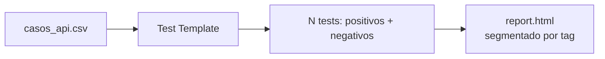

{width=120px}

# Práctica 14: Suite API data-driven: smoke y regresión desde CSV

## Metadatos

| Campo            | Detalle                                       |
|------------------|------------------------------------------------|
| **Duración**     | 72 minutos                                      |
| **Complejidad**  | Media                                           |
| **Nivel Bloom**  | Analizar (Analyze)                              |
| **Capítulo**     | 7 — Automatización de APIs con RequestsLibrary  |
| **Versión RF**   | Robot Framework 7.x                             |

---

## Descripción general

Esta práctica combina dos cosas que ya conoces: **DataDriver** (Sesión 5) y **RequestsLibrary** (Práctica 13). Vas a construir una suite de pruebas de API parametrizada desde un CSV, que cubre tanto escenarios **positivos** (200 OK) como **negativos** (404, 500), organizados con tags `smoke` y `regresion`.



```{=typst}
#flujo(("casos_api.csv", "Test Template", "N tests (positivos + negativos)", "report.html segmentado"))
```

---

## Objetivos de aprendizaje

- Diseñar un CSV de casos de API con escenarios positivos y negativos.
- Usar `expected_status=any` para validar respuestas de error sin que `RequestsLibrary` las trate como excepción.
- Organizar una suite de API en `smoke` (rápida, crítica) y `regresion` (completa).

---

## Prerrequisitos

| Área | Nivel |
|---|---|
| Práctica 9 completada (DataDriver) | Requerido |
| Práctica 13 completada (RequestsLibrary) | Requerido |

---

## ¿Por qué `expected_status=any`?

Por defecto, `RequestsLibrary` lanza una excepción automática (`HTTPError`) cuando la respuesta es un código 4xx o 5xx — útil cuando esperas siempre 200, pero un problema cuando **quieres probar deliberadamente que un 404 o 500 ocurre como se espera**. `expected_status=any` desactiva esa validación automática, dejando el `status_code` disponible para que **tú** lo compares con `Should Be Equal As Numbers`.

---

## Pasos de la práctica

### Paso 1 — Crear el CSV de casos

Crea `data/casos_api.csv`:

```csv
*** Test Cases ***,${endpoint},${status_esperado},[Tags]
Servicio responde correctamente (200),/status/200,200,"smoke,positivo"
Servicio de eco responde (200),/get,200,"smoke,positivo"
Endpoint inexistente devuelve 404,/status/404,404,"regresion,negativo"
Error interno del servidor devuelve 500,/status/500,500,"regresion,negativo"
```

`postman-echo.com/status/{codigo}` responde siempre con el código HTTP indicado en la URL — perfecto para simular casos negativos sin depender de errores reales del servidor.

---

### Paso 2 — Crear la suite con Test Template

Crea `tests/api_data_driven_suite.robot`:

```robot
*** Settings ***
Documentation     Suite API data-driven que cubre escenarios positivos y
...               negativos, segmentados por tags smoke/regresion.
Library           RequestsLibrary
Library           DataDriver    ${CURDIR}/../data/casos_api.csv    dialect=excel    encoding=utf_8
Suite Setup       Create Session    api    https://postman-echo.com    verify=True
Test Template     Verificar Status Code Del Endpoint


*** Test Cases ***
Caso De Ejemplo De API


*** Keywords ***
Verificar Status Code Del Endpoint
    [Arguments]    ${endpoint}    ${status_esperado}
    ${respuesta}=    GET On Session    api    ${endpoint}    expected_status=any
    Should Be Equal As Numbers    ${respuesta.status_code}    ${status_esperado}
```

---

### Paso 3 — Ejecutar la suite completa

```bash
robot --outputdir reports tests/api_data_driven_suite.robot
```

**Salida esperada:** `4 tests, 4 passed, 0 failed` — 2 casos positivos y 2 negativos, todos validados correctamente.

---

### Paso 4 — Revisar la segmentación por tag

Abre `reports/report.html` y revisa la sección "By Tag": debes ver `smoke` con 2 tests y `regresion` con 2 tests, además de `positivo`/`negativo`.

> 💡 **En un pipeline de CI/CD real:** la suite `smoke` (rápida, pocos casos críticos) se ejecuta en **cada** despliegue; la suite `regresion` completa se reserva para antes de un release — lo verás formalizado con `rebot` y CI/CD en la Sesión 9.

---

## Validación y pruebas

```bash
robot --outputdir reports tests/api_data_driven_suite.robot
```

### Lista de verificación final

| Criterio | Estado |
|---|---|
| 4 test cases generados desde el CSV | ☐ |
| Los 2 casos negativos (404, 500) pasan validando el código exacto | ☐ |
| `4 tests, 4 passed, 0 failed` | ☐ |
| `report.html` segmenta por `smoke`/`regresion` y `positivo`/`negativo` | ☐ |

---

## Solución de problemas

### `HTTPError: 404 Client Error` en vez de un PASS

**Causa:** olvidaste `expected_status=any` en `GET On Session` — sin eso, `RequestsLibrary` convierte cualquier 4xx/5xx en una excepción antes de que tu `assert` pueda evaluarlo.
**Solución:** agrega `expected_status=any` a la llamada.

---

## Resumen

- `DataDriver` + `RequestsLibrary` permiten cubrir muchos endpoints/códigos desde un solo archivo de datos.
- `expected_status=any` es necesario para probar deliberadamente respuestas de error.
- Separar `smoke` (rápida) de `regresion` (completa) con tags es un patrón estándar en pipelines de API.

### Próximos pasos

En la **Sesión 8** vas a aplicar Robot Framework a procesos RPA: lectura de archivos, integración con Excel, y flujos end-to-end que combinan web + API + archivos.

### Recursos

| Recurso | URL |
|---|---|
| RequestsLibrary — expected_status | <https://marketsquare.github.io/robotframework-requests/doc/RequestsLibrary.html> |
