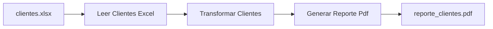

{width=120px}

# Práctica 15: Proceso RPA con lectura de Excel, transformación y generación de reporte PDF

## Metadatos

| Campo            | Detalle                                       |
|------------------|------------------------------------------------|
| **Duración**     | 72 minutos                                      |
| **Complejidad**  | Media                                           |
| **Nivel Bloom**  | Crear (Create)                                  |
| **Capítulo**     | 8 — Robot Framework Aplicado a RPA              |
| **Versión RF**   | Robot Framework 7.x                             |

---

## Descripción general

A partir de esta sesión, dejas de **probar** software y empiezas a **automatizar procesos de negocio** — el otro dominio de Robot Framework que conociste en la Práctica 1. En esta práctica vas a construir un proceso RPA clásico: leer datos de un Excel, transformarlos, y generar un reporte en PDF, con logging explícito de cada etapa.



```{=typst}
#flujo(("clientes.xlsx", "Leer Clientes Excel", "Transformar Clientes", "Generar Reporte Pdf"))
```

---

## Objetivos de aprendizaje

- Leer un archivo Excel con `openpyxl` desde una librería Python propia.
- Transformar datos (cálculo de IVA, clasificación de consumo).
- Generar un reporte PDF con `fpdf2`.
- Registrar logging explícito de cada etapa del proceso.

---

## Prerrequisitos

| Área | Nivel |
|---|---|
| Sesión 5 completada (librerías Python propias) | Requerido |
| `pip install openpyxl fpdf2` | Requerido |

---

## Pasos de la práctica

### Paso 1 — Instalar dependencias

```bash
pip install openpyxl fpdf2
```

---

### Paso 2 — Generar el archivo de entrada

Crea `scripts/generar_datos_excel.py` (se ejecuta **una sola vez** para crear el dato de prueba):

```python
from pathlib import Path
import openpyxl

RUTA_SALIDA = Path(__file__).parent.parent / "data" / "clientes.xlsx"
CLIENTES = [
    ("Ana Pérez", "Premium", 85, 150.0),
    ("Luis Gómez", "Básico", 35, 80.0),
    ("María Díaz", "Premium", 120, 150.0),
    ("Carlos Ruiz", "Básico", 15, 80.0),
]

wb = openpyxl.Workbook()
hoja = wb.active
hoja.title = "Clientes"
hoja.append(["nombre", "plan", "consumo_gb", "costo_base"])
for fila in CLIENTES:
    hoja.append(fila)
RUTA_SALIDA.parent.mkdir(parents=True, exist_ok=True)
wb.save(RUTA_SALIDA)
```

```bash
python scripts/generar_datos_excel.py
```

---

### Paso 3 — Escribir la lógica del proceso (lectura, transformación, PDF)

Crea `scripts/procesar_clientes.py` con cuatro funciones: `leer_clientes_excel`, `clasificar_consumo`, `transformar_clientes` y `generar_reporte_pdf` (ver el código completo en el repositorio de la práctica — usa `@dataclass` para modelar cada cliente, `openpyxl.load_workbook` para leer, y `fpdf.FPDF` para generar la tabla del PDF). `clasificar_consumo` es una función auxiliar que `transformar_clientes` usa internamente, y que también se expone como keyword (`Clasificar Consumo`) para poder probarla de forma aislada desde Robot Framework.

**¿Por qué `transformar_clientes` devuelve una lista nueva en vez de modificar la original?** Para evitar efectos secundarios inesperados: si otra parte del proceso todavía necesita los datos originales (sin transformar), modificarlos en el lugar los destruiría.

---

### Paso 4 — Probar la lógica con pytest

```python
def test_transformar_clientes_calcula_costo_con_iva():
    clientes = [Cliente(nombre="Ana", plan="Premium", consumo_gb=85, costo_base=150.0)]
    transformados = transformar_clientes(clientes)
    assert transformados[0].costo_total == 168.0  # 150 * 1.12
    assert transformados[0].clasificacion_consumo == "medio"
```

```bash
pytest tests_unitarios/ -v
```

---

### Paso 5 — Orquestar el proceso desde Robot Framework con logging por etapa

Crea `tests/proceso_rpa_clientes.robot`:

```robot
*** Settings ***
Documentation     Proceso RPA: lee, transforma y genera reporte, con
...               logging de cada etapa.
Library           ../scripts/procesar_clientes.py
Library           OperatingSystem


*** Variables ***
${ARCHIVO_ENTRADA}    ${CURDIR}/../data/clientes.xlsx
${ARCHIVO_SALIDA}     ${CURDIR}/../reportes/reporte_clientes.pdf


*** Test Cases ***
Proceso RPA completo: leer, transformar y generar reporte
    Log    ETAPA 1/3: Leyendo clientes desde ${ARCHIVO_ENTRADA}
    @{clientes}=    Leer Clientes Excel    ${ARCHIVO_ENTRADA}
    Log    ETAPA 1/3 completada: ${{len($clientes)}} clientes leídos

    Log    ETAPA 2/3: Transformando datos (IVA + clasificación de consumo)
    @{clientes_transformados}=    Transformar Clientes    ${clientes}
    Log    ETAPA 2/3 completada

    Log    ETAPA 3/3: Generando reporte PDF en ${ARCHIVO_SALIDA}
    ${ruta_generada}=    Generar Reporte Pdf    ${clientes_transformados}    ${ARCHIVO_SALIDA}
    Log    ETAPA 3/3 completada: reporte en ${ruta_generada}

    File Should Exist    ${ARCHIVO_SALIDA}
    ${tamano}=    Get File Size    ${ARCHIVO_SALIDA}
    Should Be True    ${tamano} > 0

Clasificar consumo de un cliente individual
    ${clasificacion}=    Clasificar Consumo    ${85}
    Should Be Equal    ${clasificacion}    medio
```

**¿Qué hace `${{len($clientes)}}`?** Es una **expresión Python embebida** (la doble llave `${{...}}`) — Robot Framework evalúa lo que está dentro como código Python real, con acceso a las variables de RF usando `$nombre` en vez de `${nombre}`. Aquí se usa para contar cuántos clientes se leyeron, sin necesitar una keyword adicional solo para eso.

---

### Paso 6 — Ejecutar el proceso

```bash
robot --outputdir reports tests/proceso_rpa_clientes.robot
```

**Salida esperada:** `2 tests, 2 passed, 0 failed`. Abre `reportes/reporte_clientes.pdf` — debe contener una tabla con los 4 clientes, su clasificación de consumo y su costo total con IVA.

---

## Validación y pruebas

```bash
python scripts/generar_datos_excel.py     # solo la primera vez
pytest tests_unitarios/ -v
robot --outputdir reports tests/proceso_rpa_clientes.robot
```

### Lista de verificación final

| Criterio | Estado |
|---|---|
| `data/clientes.xlsx` generado con 4 clientes | ☐ |
| Tests de `pytest` en verde | ☐ |
| `2 tests, 2 passed, 0 failed` en Robot Framework | ☐ |
| `reportes/reporte_clientes.pdf` generado, con tabla legible | ☐ |
| Las 3 etapas (lectura, transformación, generación) aparecen en `log.html` | ☐ |

---

## Solución de problemas

### `KeyError: "Worksheet Clientes does not exist"`

**Causa:** el Excel no tiene una hoja llamada exactamente `Clientes`.
**Solución:** confirma el nombre de la hoja en `generar_datos_excel.py` (`hoja.title = "Clientes"`).

### El PDF se genera pero las tildes/ñ se ven mal

**Causa:** poco común con `fpdf2` y la fuente `Helvetica` (soporta UTF-8 razonablemente bien), pero si ocurre, revisa la codificación del archivo fuente.
**Solución:** confirma que el archivo `.py` está guardado en UTF-8 (el estándar en cualquier editor moderno).

---

## Resumen

- Un proceso RPA típico tiene 3 etapas: leer, transformar, generar salida.
- `openpyxl` lee/escribe Excel; `fpdf2` genera PDFs — ninguna requiere licencias de Office.
- El logging explícito por etapa (`Log    ETAPA N/3: ...`) hace que un proceso RPA sea diagnosticable cuando algo falla.
- `${{expresión Python}}` embebe código Python directo dentro de un valor de Robot Framework.

### Próximos pasos

En la **Práctica 16** vas a construir un proceso RPA end-to-end que integra web + API + archivos, cerrado con un checklist de calidad.

### Recursos

| Recurso | URL |
|---|---|
| openpyxl (documentación) | <https://openpyxl.readthedocs.io/> |
| fpdf2 (documentación) | <https://py-pdf.github.io/fpdf2/> |
