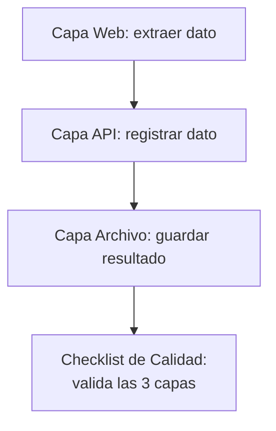

# Práctica 16: Proceso RPA end-to-end: web + API + archivos con checklist de calidad

## Metadatos

| Campo            | Detalle                                       |
|------------------|------------------------------------------------|
| **Duración**     | 72 minutos                                      |
| **Complejidad**  | Alta                                            |
| **Nivel Bloom**  | Crear (Create)                                  |
| **Capítulo**     | 8 — Robot Framework Aplicado a RPA              |
| **Versión RF**   | Robot Framework 7.x                             |

---

## Descripción general

Esta práctica integra **todo** lo que has aprendido en el curso: navegación web (Sesión 6), llamadas API (Sesión 7), manejo de archivos (Práctica 15) y manejo de errores (Sesión 3) — en un solo proceso RPA de tres capas, cerrado con un **checklist de calidad** explícito que valida cada capa por separado.



```{=typst}
#flujo-vertical(("Capa Web: extraer dato", "Capa API: registrar dato", "Capa Archivo: guardar resultado", "Checklist de Calidad: valida las 3 capas"))
```

---

## Objetivos de aprendizaje

- Integrar `SeleniumLibrary`, `RequestsLibrary` y `OperatingSystem` en un solo proceso.
- Diseñar un checklist de calidad explícito (no solo un `assert` ciego al final).
- Aplicar manejo de errores en un contexto RPA de varias capas.

---

## Prerrequisitos

| Área | Nivel |
|---|---|
| Sesión 6 (SeleniumLibrary), Sesión 7 (RequestsLibrary) y Práctica 15 completadas | Requerido |

---

## Pasos de la práctica

### Paso 1 — Configurar la suite con las 3 librerías

Crea `tests/rpa_e2e_suite.robot`:

```robot
*** Settings ***
Documentation     Proceso RPA end-to-end: Web -> API -> Archivo, cerrado
...               con un checklist de calidad.
Library           SeleniumLibrary
Library           RequestsLibrary
Library           OperatingSystem
Library           Collections
Suite Setup       Create Session    api    https://postman-echo.com    verify=True


*** Variables ***
${URL_TABLA}          https://the-internet.herokuapp.com/tables
${SELECTOR_NOMBRE}    css:#table1 tbody tr:nth-child(1) td:nth-child(1)
${ARCHIVO_SALIDA}      ${CURDIR}/../salida/resultado_rpa.csv
```

---

### Paso 2 — Capa Web: extraer un dato real de una tabla

```robot
*** Test Cases ***
Proceso RPA E2E: extraer, registrar vía API y archivar con checklist
    [Teardown]    Close All Browsers

    Log    CAPA WEB: extrayendo dato de la tabla
    Open Browser    ${URL_TABLA}    headlesschrome
    Wait Until Element Is Visible    ${SELECTOR_NOMBRE}    timeout=10s
    ${apellido_extraido}=    Get Text    ${SELECTOR_NOMBRE}
    Log    CAPA WEB completada: apellido extraído = ${apellido_extraido}
```

`the-internet.herokuapp.com/tables` tiene una tabla de datos estática — ideal para practicar extracción de datos web sin depender de un sistema propio.

---

### Paso 3 — Capa API: registrar el dato extraído

Agrega al mismo test case:

```robot
    Log    CAPA API: registrando el dato extraído
    &{payload}=    Create Dictionary    apellido_cliente=${apellido_extraido}    origen=rpa-practica-16
    ${respuesta}=    POST On Session    api    /post    json=${payload}
    Log    CAPA API completada: status=${respuesta.status_code}
```

---

### Paso 4 — Capa Archivo: registrar el resultado localmente

```robot
    Log    CAPA ARCHIVO: registrando el resultado localmente
    Create Directory    ${CURDIR}/../salida
    Append To File    ${ARCHIVO_SALIDA}    ${apellido_extraido},${respuesta.status_code}\n
    Log    CAPA ARCHIVO completada: ${ARCHIVO_SALIDA}
```

---

### Paso 5 — Checklist de calidad: validar las 3 capas explícitamente

Un checklist real reporta el estado de **cada** verificación, no solo si "algo" falló al final. Agrega esta keyword:

```robot
*** Keywords ***
Ejecutar Checklist De Calidad
    [Arguments]    ${apellido}    ${status_api}    ${ruta_archivo}
    ${checklist}=    Create List
    ${item_web}=    Set Variable If    """${apellido}""" != ""    PASS    FAIL
    Append To List    ${checklist}    Capa Web (dato no vacío): ${item_web}

    ${item_api}=    Set Variable If    ${status_api} == 200    PASS    FAIL
    Append To List    ${checklist}    Capa API (status 200): ${item_api}

    ${archivo_existe}=    Run Keyword And Return Status    File Should Exist    ${ruta_archivo}
    ${item_archivo}=    Set Variable If    ${archivo_existe}    PASS    FAIL
    Append To List    ${checklist}    Capa Archivo (existe): ${item_archivo}

    FOR    ${item}    IN    @{checklist}
        Log    CHECKLIST: ${item}
    END

    Should Not Contain    ${checklist}    Capa Web (dato no vacío): FAIL
    Should Not Contain    ${checklist}    Capa API (status 200): FAIL
    Should Not Contain    ${checklist}    Capa Archivo (existe): FAIL
```

Y llama esta keyword al final del test case:

```robot
    Ejecutar Checklist De Calidad    ${apellido_extraido}    ${respuesta.status_code}    ${ARCHIVO_SALIDA}
```

**¿Qué aporta este patrón sobre un `assert` simple al final?** Visibilidad. Si algo falla, en `log.html` ves exactamente **cuál** de las 3 capas falló (`CHECKLIST: Capa API (status 200): FAIL`), en vez de un solo mensaje genérico de error al final del proceso — crítico para diagnosticar procesos RPA en producción, donde nadie está mirando la pantalla en tiempo real.

**¿Qué hace `Run Keyword And Return Status`?** Ejecuta una keyword y devuelve `True`/`False` según si pasó o falló, sin propagar la excepción — lo viste como concepto en la Sesión 3 (`Run Keyword And Ignore Error` es similar, pero devuelve también el mensaje).

---

### Paso 6 — Ejecutar el proceso completo

```bash
robot --outputdir reports tests/rpa_e2e_suite.robot
```

**Salida esperada:** `1 test, 1 passed, 0 failed`. Revisa `salida/resultado_rpa.csv` — debe tener una línea con el apellido extraído y el código de estado de la API.

---

## Validación y pruebas

```bash
robot --outputdir reports tests/rpa_e2e_suite.robot
cat salida/resultado_rpa.csv
```

### Lista de verificación final

| Criterio | Estado |
|---|---|
| `1 test, 1 passed, 0 failed` | ☐ |
| `salida/resultado_rpa.csv` contiene el apellido extraído y un status 200 | ☐ |
| El checklist muestra las 3 capas en `PASS` en `log.html` | ☐ |
| Ejecutar el proceso 2 veces seguidas produce el mismo resultado (estable) | ☐ |

---

## Solución de problemas

### El checklist marca `Capa Web (dato no vacío): FAIL` aunque el navegador abrió bien

**Causa:** el selector CSS de la tabla puede no coincidir si la página cambió, o el navegador no esperó suficiente tiempo.
**Solución:** aumenta el `timeout` de `Wait Until Element Is Visible`, o inspecciona la tabla manualmente para confirmar el selector.

### `Append To File` agrega líneas duplicadas en ejecuciones sucesivas

**Causa:** es el comportamiento esperado de `Append To File` — agrega, no reemplaza. Si quieres un archivo limpio en cada ejecución, usa `Remove File` antes (con `Run Keyword And Ignore Error` para que no falle si el archivo no existe todavía).

---

## Resumen

- Un proceso RPA real frecuentemente combina varias tecnologías (web, API, archivos) en un solo flujo.
- Un checklist de calidad explícito, con `Log` por cada verificación, hace que el diagnóstico de un fallo sea inmediato.
- `Run Keyword And Return Status` es útil cuando solo necesitas un booleano de éxito/fallo, sin el mensaje de error.

### Próximos pasos

En la **Sesión 9**, la última del curso, vas a dominar la ejecución avanzada por CLI, el reporting con `rebot`, y vas a prepararte para la certificación RFCP con un simulacro de examen.

### Recursos

| Recurso | URL |
|---|---|
| Run Keyword And Return Status | <https://robotframework.org/robotframework/latest/libraries/BuiltIn.html#Run%20Keyword%20And%20Return%20Status> |
