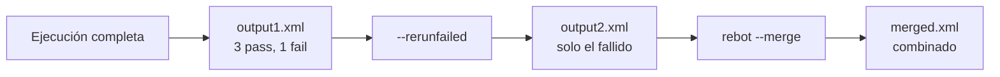

# Práctica 17: Ejecución avanzada por CLI con filtros de tags y regeneración de reportes

## Metadatos

| Campo            | Detalle                                       |
|------------------|------------------------------------------------|
| **Duración**     | 54 minutos                                      |
| **Complejidad**  | Media                                           |
| **Nivel Bloom**  | Aplicar (Apply)                                 |
| **Capítulo**     | 9 — Ejecución Avanzada, Reporting y Preparación RFCP |
| **Versión RF**   | Robot Framework 7.x                             |

---

## Descripción general

Esta práctica consolida el dominio del CLI de Robot Framework: combinaciones lógicas de tags (`AND`/`OR`), reejecución selectiva de tests fallidos (`--rerunfailed`), y combinación de varios reportes en uno con `rebot` — herramientas que usarás constantemente en un pipeline de CI/CD real.



```{=typst}
#flujo-vertical(("Ejecución completa -> output1.xml", "--rerunfailed -> output2.xml (solo fallidos)", "rebot --merge -> merged.xml"))
```

---

## Objetivos de aprendizaje

- Combinar tags con operadores lógicos (`AND`, `OR`) desde la línea de comandos.
- Reejecutar selectivamente los tests que fallaron con `--rerunfailed`.
- Combinar varios `output.xml` en un solo reporte con `rebot --merge`.

---

## Prerrequisitos

| Área | Nivel |
|---|---|
| Sesión 2 completada (tags, `--include`/`--exclude`) | Requerido |

---

## Pasos de la práctica

### Paso 1 — Crear la suite con tags variados

Crea `tests/suite_avanzada.robot`:

```robot
*** Settings ***
Documentation     Suite con tags variados para practicar filtrado avanzado.


*** Test Cases ***
TC-01 Prueba smoke critica
    [Tags]    smoke    critico
    Should Be True    ${True}

TC-02 Prueba smoke no critica
    [Tags]    smoke
    Should Be True    ${True}

TC-03 Prueba de regresion que falla a proposito
    [Documentation]    Falla intencional, para practicar --rerunfailed.
    [Tags]    regresion
    Should Be Equal    ${1}    ${2}

TC-04 Prueba de regresion exitosa
    [Tags]    regresion
    Should Be True    ${True}
```

---

### Paso 2 — Combinar tags con AND/OR (paretags)

```bash
# Solo el test que tiene AMBOS tags (smoke Y critico)
robot --include smokeANDcritico tests/suite_avanzada.robot
# -> 1 test, 1 passed

# Tests que tienen AL MENOS UNO de los dos tags
robot --include criticoORregresion tests/suite_avanzada.robot
# -> 3 tests, 2 passed, 1 failed
```

> ⚠️ **Sintaxis exacta:** los operadores `AND`/`OR`/`NOT` van **en mayúsculas y sin espacios** alrededor (`smokeANDcritico`, no `smoke AND critico`). Es un detalle fácil de pasar por alto y un error común al automatizar pipelines.

---

### Paso 3 — Ejecutar, guardar el output, y reejecutar solo lo fallido

```bash
robot --outputdir reports --output output1.xml tests/suite_avanzada.robot
```

**Salida esperada:** `4 tests, 3 passed, 1 failed` (TC-03 falla a propósito).

```bash
robot --outputdir reports --rerunfailed reports/output1.xml --output output2.xml tests/suite_avanzada.robot
```

**Salida esperada:** `1 test, 0 passed, 1 failed` — solo TC-03 se reejecuta (sigue fallando porque el fallo es intencional y permanente en esta práctica; en un caso real, podrías corregir el bug entre la primera ejecución y el rerun).

**¿Para qué sirve `--rerunfailed` en la práctica?** En una suite de cientos de tests, reejecutar **solo** los que fallaron (en vez de la suite completa) ahorra tiempo valioso — especialmente útil para distinguir un fallo real de un fallo intermitente (*flaky*).

---

### Paso 4 — Combinar ambos resultados con rebot

```bash
rebot --outputdir reports --merge --output merged.xml reports/output1.xml reports/output2.xml
```

**¿Qué hace `--merge`?** Combina los resultados como si hubieran sido una sola ejecución, usando el resultado **más reciente** de cada test que se repite entre los archivos — útil para "fusionar" una ejecución original con sus reintentos en un solo reporte final.

---

## Validación y pruebas

```bash
robot --outputdir reports --output output1.xml tests/suite_avanzada.robot
robot --outputdir reports --rerunfailed reports/output1.xml --output output2.xml tests/suite_avanzada.robot
rebot --outputdir reports --merge --output merged.xml reports/output1.xml reports/output2.xml
```

### Lista de verificación final

| Criterio | Estado |
|---|---|
| `--include smokeANDcritico` ejecuta solo 1 test | ☐ |
| `--include criticoORregresion` ejecuta 3 tests | ☐ |
| `--rerunfailed` reejecuta solo TC-03 | ☐ |
| `merged.xml` combina ambas ejecuciones | ☐ |

---

## Solución de problemas

### `--include smoke AND critico` no funciona (con espacios)

**Causa:** los operadores de paretags **no** llevan espacios.
**Solución:** escribe `smokeANDcritico`, sin espacios y con el operador en mayúsculas.

---

## Resumen

- Los paretags (`AND`, `OR`, `NOT`, sin espacios, mayúsculas) combinan condiciones de filtrado.
- `--rerunfailed <output.xml>` reejecuta solo los tests que fallaron en esa ejecución.
- `rebot --merge` combina varios `output.xml` en un solo reporte, usando el resultado más reciente de cada test repetido.

### Próximos pasos

En la **Práctica 18**, la última del curso, vas a resolver un simulacro de certificación RFCP y construir un proyecto final integrador.

### Recursos

| Recurso | URL |
|---|---|
| Robot Framework User Guide — CLI | <https://robotframework.org/robotframework/latest/RobotFrameworkUserGuide.html#configuring-execution> |
