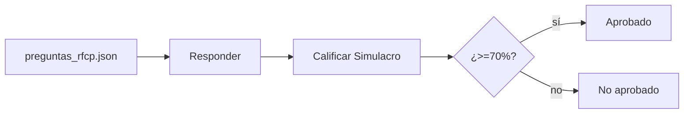

# Práctica 18: Simulacro RFCP y proyecto final integrador

## Metadatos

| Campo            | Detalle                                       |
|------------------|------------------------------------------------|
| **Duración**     | 54 minutos                                      |
| **Complejidad**  | Alta                                            |
| **Nivel Bloom**  | Evaluar (Evaluate)                              |
| **Capítulo**     | 9 — Ejecución Avanzada, Reporting y Preparación RFCP |
| **Versión RF**   | Robot Framework 7.x                             |

---

## Descripción general

Esta es la práctica de cierre del curso. Tiene dos partes: (1) un **simulacro de examen RFCP** con 10 preguntas que cubren los temas centrales de las 9 sesiones, calificado automáticamente con un umbral de aprobación del 70% (igual al examen real); y (2) un ejercicio de síntesis — un plan de adopción regional de automatización con Robot Framework, basado en todo lo que aprendiste.



```{=typst}
#flujo-vertical(("preguntas_rfcp.json", "Responder", "Calificar Simulacro", "¿>= 70%? -> Aprobado / No aprobado"))
```

---

## Objetivos de aprendizaje

- Resolver preguntas tipo certificación RFCP que integran las 9 sesiones del curso.
- Construir y probar un motor de calificación con un umbral de aprobación.
- Presentar un plan de adopción de automatización con Robot Framework.

---

## Prerrequisitos

| Área | Nivel |
|---|---|
| Las 8 sesiones anteriores completadas | Requerido |

---

## Parte 1 — Simulacro de examen RFCP

### Paso 1 — Responder las 10 preguntas

Abre `data/preguntas_rfcp.json` y responde, **sin mirar el curso**, las 10 preguntas. Algunas, a modo de ejemplo:

> **1.** ¿Cuál es la única sección obligatoria en un archivo `.robot`?
> a) Settings  b) Variables  c) **Test Cases**  d) Keywords

> **7.** ¿Qué opción de CLI ejecuta solo los test cases que fallaron en una ejecución anterior?
> a) `--include`  b) `--exclude`  c) **`--rerunfailed`**  d) `--suite`

(Las 10 preguntas completas, con sus 4 opciones cada una, están en el archivo JSON — cúbrelas todas antes de revisar las respuestas).

### Paso 2 — Calificar tu propio simulacro

Crea `scripts/simulacro_rfcp.py` con dos funciones: `cargar_preguntas` (lee el JSON) y `calificar_simulacro` (compara tus respuestas contra `respuesta_correcta` de cada pregunta, calcula el porcentaje, y determina si apruebas con el umbral `UMBRAL_APROBACION = 70.0`).

```python
from simulacro_rfcp import cargar_preguntas, calificar_simulacro

preguntas = cargar_preguntas("data/preguntas_rfcp.json")
mis_respuestas = {1: "Test Cases", 2: "BuiltIn", 7: "--rerunfailed", ...}  # completa las 10
resultado = calificar_simulacro(preguntas, mis_respuestas)
print(f"{resultado.correctas}/{resultado.total_preguntas} ({resultado.porcentaje}%) — Aprobado: {resultado.aprobado}")
```

---

### Paso 3 — Probar el motor de calificación con pytest

```bash
pytest tests_unitarios/ -v
```

**Salida esperada:** 6 tests en verde, incluyendo el caso límite de exactamente 70% (debe aprobar — el umbral es inclusivo).

---

### Paso 4 — Integrar el simulacro a una suite Robot Framework

Crea `tests/simulacro_rfcp_suite.robot`, que simula dos participantes (uno con 80%, que aprueba; otro con 50%, que no) usando la librería Python directamente:

```robot
*** Settings ***
Library           ../scripts/simulacro_rfcp.py
Library           Collections


*** Test Cases ***
Simulacro RFCP: un participante con 8 de 10 correctas aprueba
    @{preguntas}=    Cargar Preguntas    ${CURDIR}/../data/preguntas_rfcp.json
    &{respuestas}=    Construir Respuestas Con N Incorrectas    ${preguntas}    ${2}
    ${resultado}=    Calificar Simulacro    ${preguntas}    ${respuestas}
    Should Be True    ${resultado.aprobado}
```

```bash
robot --outputdir reports tests/simulacro_rfcp_suite.robot
```

**Salida esperada:** `2 tests, 2 passed, 0 failed`.

---

## Parte 2 — Proyecto final integrador: plan de adopción regional

Prepara una presentación breve (10-15 minutos) dirigida a un equipo de TI de telecomunicaciones que **todavía no usa automatización**, cubriendo:

1. **Diagnóstico:** ¿qué procesos actuales de QA/operaciones se beneficiarían más de automatización (pruebas) vs. RPA?
2. **Arquitectura propuesta:** estructura de carpetas, capas de keywords (técnica/dominio/negocio), convenciones de tags.
3. **Plan de adopción por fases:** ¿qué automatizarías primero (quick wins) y qué dejarías para después?
4. **Integración con CI/CD:** cómo encajaría `robot`/`rebot` en un pipeline existente (GitHub Actions o Jenkins).
5. **Preparación de equipo:** ¿qué necesita saber tu equipo para mantener esto a largo plazo?

> 💡 Usa como referencia los ejemplos de telecomunicaciones que viste en el curso: activación de planes (Sesión 4), gestión de clientes (Sesión 2), procesamiento de Excel/PDF (Sesión 8).

---

## Validación y pruebas

```bash
pytest tests_unitarios/ -v
robot --outputdir reports tests/simulacro_rfcp_suite.robot
```

### Lista de verificación final

| Criterio | Estado |
|---|---|
| Respondiste las 10 preguntas antes de revisar las respuestas | ☐ |
| Tests de `pytest` en verde (incluyendo el caso de 70% exacto) | ☐ |
| `2 tests, 2 passed, 0 failed` en la suite Robot Framework | ☐ |
| Plan de adopción cubre las 5 áreas listadas | ☐ |

---

## Resumen

- El umbral de aprobación de RFCP es 70% — el mismo que usamos en este simulacro.
- Construir y probar tu propio motor de calificación es, en sí, un ejercicio de integración de todo el curso: Python puro, pytest, librería personalizada, Robot Framework.
- Un plan de adopción real necesita diagnóstico, arquitectura, fases, CI/CD y preparación de equipo — no solo "saber Robot Framework".

### Cierre del curso

Completaste las 9 sesiones: fundamentos, sintaxis, control de flujo, BDD, extensión con Python, web, APIs, RPA, y ejecución avanzada. Tienes las bases para presentar el examen oficial **RFCP** y para liderar la adopción de automatización con Robot Framework en tu organización.

### Recursos

| Recurso | URL |
|---|---|
| Robot Framework Certified Professional (RFCP) | <https://robotframework.org/> |
| Robot Framework Foundation | <https://robotframework.org/foundation/> |
