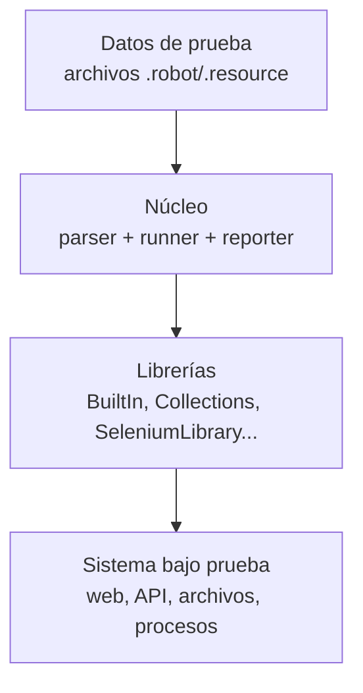

# Capítulo 1 — Fundamentos de Automatización y Robot Framework

## Información general

Este capítulo presenta el ecosistema de Robot Framework y resuelve la primera confusión que todo estudiante de automatización enfrenta: ¿qué es exactamente lo que vamos a construir, pruebas o robots de proceso? También dejamos listo el entorno de trabajo y entendemos, en profundidad, cómo está construido un archivo `.robot` por dentro — no solo su sintaxis superficial, sino el modelo de ejecución que hay detrás.

**Lecciones de este capítulo:**

- 1.1 — Automatización de pruebas vs. RPA: diferencias, casos de uso y alcance
- 1.2 — Ecosistema Robot Framework: arquitectura, librerías nativas y alcance de RFCP
- 1.3 — Instalación y configuración del entorno: Python, RF, IDE y plugins
- 1.4 — Estructura de un test case: secciones, keywords integradas y primer suite

---

## 1.1 Automatización de pruebas vs. RPA: diferencias, casos de uso y alcance

### Objetivos de la lección

Al terminar esta lección serás capaz de:

- Distinguir el propósito de la automatización de pruebas del propósito de la RPA.
- Identificar a qué dominio pertenece un escenario concreto.
- Explicar por qué Robot Framework cubre ambos dominios con una sola sintaxis.

### ¿Por qué importa?

Antes de escribir una sola línea de código, necesitas saber **qué tipo de problema** estás resolviendo. Un equipo que confunde "verificar calidad" con "ejecutar un proceso" termina eligiendo la arquitectura equivocada: diseña asserts donde necesitaba transacciones, o diseña reintentos infinitos donde necesitaba un veredicto claro de pass/fail. Esta distinción condiciona literalmente cada decisión de diseño del resto del curso.

### Conceptos clave

#### El propósito de la automatización de pruebas

La **automatización de pruebas** existe para **verificar la calidad de un sistema que ya fue construido por alguien más** (un equipo de desarrollo). No crea valor de negocio directamente — su valor es la *confianza*: saber que un cambio de código no rompió algo que funcionaba. Su producto es un veredicto binario: el sistema se comportó como se esperaba (`PASS`) o no (`FAIL`). La audiencia de ese veredicto es el equipo de desarrollo y QA, y normalmente se ejecuta **cada vez que el código cambia**, dentro de un pipeline de integración continua. El ciclo de vida de un test es corto: se escribe, se ejecuta miles de veces, y eventualmente se actualiza o se elimina cuando el comportamiento que valida cambia intencionalmente.

#### El propósito de la RPA

La **RPA** (*Robotic Process Automation*), en cambio, existe para **ejecutar un proceso de negocio de extremo a extremo**, igual que lo haría una persona siguiendo un procedimiento repetitivo: descargar un archivo, leerlo, transformarlo, subir el resultado a un sistema. Su producto no es un veredicto, es un **resultado operativo** — una factura procesada, un registro creado, un correo enviado. La audiencia es el área de negocio que depende de ese proceso, y se ejecuta según un calendario (todos los días a las 2am) o un evento disparador (llega un correo, se deposita un archivo en una carpeta). El ciclo de vida de un robot RPA suele ser más largo y más crítico operativamente: si falla, alguien en el negocio no recibe su factura procesada hoy.

#### La analogía que distingue ambos roles

Una analogía útil: la automatización de pruebas es un **inspector de calidad** que revisa cada pieza que sale de la línea de producción, comparándola contra una especificación; la RPA es el **operario** que ensambla esas piezas siguiendo un procedimiento. Ambos trabajan en la misma fábrica, pero confundir sus roles te lleva a elegir la herramienta equivocada para el problema que realmente tienes: pedirle al inspector que ensamble piezas (un test que "arregla" datos en producción) es tan problemático como pedirle al operario que decida si la pieza cumple con la norma (un robot RPA sin ninguna validación de los datos que procesa).

#### Tabla comparativa completa

| Dimensión | Automatización de pruebas | RPA |
|---|---|---|
| Propósito | Verificar calidad | Ejecutar un proceso de negocio |
| Producto | Reporte PASS/FAIL | Resultado operativo (archivo, registro, notificación) |
| Audiencia | QA / Desarrollo | Áreas de negocio / operaciones |
| Disparador típico | Cambio de código (CI/CD) | Horario o evento externo |
| Ciclo de vida | Corto, se actualiza con el código | Largo, crítico operativamente |
| Falla típica | Detecta un defecto antes de producción | Detiene un proceso de negocio en curso |
| Ejemplo | "El botón Pagar muestra el mensaje correcto" | "Descargar facturas PDF del correo y cargarlas al ERP" |

#### Cómo elegir el enfoque correcto

La pregunta clave es: **"¿necesito *verificar* un sistema, o *ejecutar* un proceso?"**. Si el resultado que esperas es un reporte de calidad que alguien de tecnología va a leer, es automatización de pruebas. Si el resultado es un artefacto operativo que el negocio necesita (un archivo, un registro, una notificación), es RPA. Una señal práctica adicional: si tu primer instinto es escribir `Should Be Equal` o `Should Contain`, probablemente estás en el dominio de pruebas; si tu primer instinto es escribir "leer archivo, transformar dato, guardar resultado", estás en RPA.

### Ejemplo comentado

```robot
*** Test Cases ***
# Automatización de pruebas: el resultado se VERIFICA con un assert.
# Si la verificación falla, el TEST falla — eso es exactamente lo que
# queremos que pase, porque significa que detectamos un defecto.
Verificar Que El Botón Pagar Muestra El Mensaje Correcto
    Click Button    Pagar
    Wait Until Element Is Visible    css:#confirmacion
    Element Should Contain    css:#confirmacion    Pago procesado correctamente

*** Tasks ***
# RPA: no hay un "assert" de negocio — el resultado es la ACCIÓN.
# Robot Framework usa la sección *** Tasks *** (en vez de *** Test Cases ***)
# para procesos RPA; el motor de ejecución es el mismo, pero el vocabulario
# de la sección comunica la intención: aquí no se "prueba" nada, se "hace".
Procesar Facturas Recibidas Por Correo
    @{adjuntos}=    Descargar Adjuntos Del Correo    bandeja=facturas@empresa.com
    FOR    ${adjunto}    IN    @{adjuntos}
        ${datos}=    Extraer Datos De Factura    ${adjunto}
        Cargar Factura En ERP    ${datos}
    END
```

**¿Qué cambia realmente entre ambos bloques?** La sección (`Test Cases` vs. `Tasks`) y el vocabulario de las keywords. El motor de Robot Framework procesa ambas de forma casi idéntica — la diferencia es semántica, comunica al equipo qué tipo de unidad de trabajo es cada una.

### Tabla de referencia rápida

| Sección de Robot Framework | Dominio típico | Qué representa cada unidad |
|---|---|---|
| `*** Test Cases ***` | Automatización de pruebas | Una verificación con resultado PASS/FAIL |
| `*** Tasks ***` | RPA | Un paso de un proceso de negocio |

### Errores comunes

- **Escribir un "test" RPA con un assert al final, pero sin ninguna acción real de negocio antes** — confunde verificación con ejecución; si el objetivo es procesar facturas, el "éxito" debe ser que la factura quedó procesada, no solo que una condición lógica se cumplió.
- **Tratar un fallo de RPA como un fallo de test** — en RPA, un fallo a media ejecución puede dejar el proceso de negocio en un estado parcial (por ejemplo, una factura descargada pero no cargada al ERP); la recuperación de ese estado parcial es un problema que no existe en automatización de pruebas, donde cada test es independiente.
- **Usar `*** Test Cases ***` para todo, incluso procesos RPA** — funciona técnicamente, pero pierde la comunicación semántica que `*** Tasks ***` le da al equipo.

### Puntos clave

- Automatización de pruebas → verificar calidad → reporte PASS/FAIL → ciclo de vida corto, atado al código.
- RPA → ejecutar procesos de negocio → resultado operativo → ciclo de vida largo, atado al calendario/eventos del negocio.
- Robot Framework cubre ambos dominios con una sola sintaxis, distinguiendo `*** Test Cases ***` de `*** Tasks ***`.

### Autoevaluación

1. Una empresa de telecomunicaciones necesita verificar que el portal de autogestión de clientes calcula correctamente el cargo por exceso de datos. ¿Es esto automatización de pruebas o RPA?
2. La misma empresa necesita, todas las noches a las 11pm, descargar el archivo de consumos del día, calcular los cargos, y subir el resultado al sistema de facturación. ¿Es esto automatización de pruebas o RPA?
3. ¿Qué sección de Robot Framework comunica semánticamente que una unidad de trabajo es un paso de proceso de negocio, no una verificación?
4. Verdadero o falso: en RPA, un fallo a mitad de ejecución no tiene impacto fuera de la prueba misma, igual que en automatización de pruebas.

**Respuestas:** 1. Automatización de pruebas (se está *verificando* un cálculo). 2. RPA (se está *ejecutando* un proceso de negocio recurrente con resultado operativo). 3. `*** Tasks ***`. 4. Falso — un fallo de RPA a mitad de ejecución puede dejar un proceso de negocio en estado parcial, con impacto operativo real.

---

## 1.2 Ecosistema Robot Framework: arquitectura, librerías nativas y alcance de RFCP

### Objetivos de la lección

- Describir la arquitectura en capas de Robot Framework.
- Identificar las librerías nativas y su propósito.
- Explicar qué evalúa (y qué no evalúa) la certificación RFCP.

### ¿Por qué importa?

Reducir Robot Framework a "una herramienta de automatización de pruebas" subestima lo que realmente es, y lleva a decisiones de arquitectura equivocadas: por ejemplo, intentar resolver todo dentro del núcleo cuando la solución correcta es escribir una librería nueva, o no entender por qué cierto comportamiento de una librería de comunidad (como `SeleniumLibrary`) no aplica a otra (como `RequestsLibrary`). Entender la arquitectura en capas te da el modelo mental correcto para diagnosticar problemas y diseñar extensiones.

### Conceptos clave

#### La arquitectura en cuatro capas

Robot Framework está diseñado con **separación de responsabilidades**, no es un monolito cerrado:



```{=typst}
#flujo-vertical(("Datos de prueba (.robot / .resource)", "Núcleo (parser + runner + reporter)", "Librerías (BuiltIn, Collections, SeleniumLibrary...)", "Sistema bajo prueba (web, API, archivos, procesos)"))
```

1. **Datos de prueba**: los archivos `.robot` y `.resource` que tú escribes — texto plano, sin lógica de ejecución propia.
2. **Núcleo**: parsea esos archivos, construye un árbol de ejecución, ejecuta cada keyword en orden, y genera los reportes. El núcleo **no sabe nada** de navegadores ni de HTTP — esa lógica vive exclusivamente en las librerías. Esta separación es la razón por la que Robot Framework puede automatizar dominios tan distintos (web, API, archivos, bases de datos) sin cambiar su motor.
3. **Librerías**: traducen keywords en acciones concretas (clic en un botón, petición HTTP, lectura de un Excel). Pueden ser nativas (incluidas con Robot Framework), de comunidad (instaladas con `pip`), o propias (las que tú escribes, como viste — o verás — en la Sesión 5).
4. **Sistema bajo prueba (SUT)**: la aplicación, API o proceso que realmente se está automatizando — fuera del control de Robot Framework, solo se interactúa con él a través de las librerías.

#### Cómo el núcleo resuelve una keyword

Cuando escribes una línea como `Should Be Equal    ${a}    ${b}`, el núcleo busca esa keyword en este orden: primero en el archivo actual (keywords definidas localmente), luego en los `Resource` importados, y finalmente en las `Library` importadas, en el orden en que fueron declaradas en `Settings`. Si dos librerías importadas exponen una keyword con el mismo nombre, Robot Framework lanza un error de ambigüedad **a menos que** se use el prefijo de librería (`BuiltIn.Should Be Equal`) para desambiguar — un detalle que rara vez se nota hasta que un proyecto crece e importa muchas librerías.

#### Librerías nativas: referencia completa

Las librerías nativas vienen incluidas con la instalación de Robot Framework — no requieren `pip install` adicional:

| Librería | Importación | Para qué sirve |
|---|---|---|
| `BuiltIn` | Automática, siempre disponible | Aserciones, logging, control de flujo, conversiones de tipo |
| `Collections` | `Library Collections` | Crear y verificar listas y diccionarios |
| `OperatingSystem` | `Library OperatingSystem` | Archivos, carpetas, variables de entorno, rutas |
| `String` | `Library String` | Manipulación de texto: split, strip, formato |
| `DateTime` | `Library DateTime` | Cálculos y formato de fechas/horas |
| `Process` | `Library Process` | Ejecutar procesos externos del sistema operativo |
| `Telnet` | `Library Telnet` | Conexiones Telnet (uso especializado) |
| `XML` | `Library XML` | Lectura y manipulación de documentos XML |

`BuiltIn` es la única que **no** requiere una línea `Library` en `Settings` — todas sus keywords (`Should Be Equal`, `Log`, `Convert To Integer`...) están siempre disponibles en cualquier suite, sin excepción. Las demás bibliotecas, nativas o no, sí deben declararse explícitamente.

#### El alcance exacto de la certificación RFCP

**RFCP** (Robot Framework Certified Professional) es la certificación oficial emitida por la **Robot Framework Foundation**. Evalúa el dominio del **lenguaje y la plataforma central** — sintaxis, estructura de archivos, variables, control de flujo, manejo de errores, librerías nativas, y ejecución por CLI. Esto es importante para tu preparación: **NO** incluye conocimiento específico de `SeleniumLibrary`, `RequestsLibrary`, `DataDriver` ni ninguna librería de comunidad — esas son evaluadas, si acaso, en certificaciones o evaluaciones separadas y específicas de cada herramienta. La certificación te valida como alguien que domina Robot Framework **como lenguaje**, independientemente de para qué lo use después: web, API, RPA, bases de datos, o cualquier otro dominio que una librería pueda cubrir en el futuro.

### Ejemplo comentado

```robot
*** Settings ***
# BuiltIn no aparece aquí — está disponible sin declararse.
Library    Collections
Library    OperatingSystem

*** Test Cases ***
Demostrar Tres Capas De Librerías En Una Suite
    # BuiltIn (núcleo del lenguaje): siempre disponible
    Log    Iniciando demostración

    # Collections (nativa, declarada explícitamente)
    ${lista}=    Create List    uno    dos    tres
    Should Contain    ${lista}    dos

    # OperatingSystem (nativa, declarada explícitamente)
    ${existe}=    Run Keyword And Return Status    File Should Exist    /tmp
    Should Be True    ${existe}
```

### Tabla de referencia rápida

| Pregunta del examen RFCP (estilo) | Respuesta |
|---|---|
| ¿Qué evalúa RFCP? | El lenguaje y la plataforma central de Robot Framework |
| ¿Incluye SeleniumLibrary? | No |
| ¿Qué librería nunca se declara con `Library`? | `BuiltIn` |
| ¿Qué capa traduce keywords en acciones concretas? | Las librerías |

### Errores comunes

- **Asumir que toda keyword requiere `Library` en Settings** — `BuiltIn` es la excepción, y es justo la que más se usa al empezar.
- **Estudiar `SeleniumLibrary` o `RequestsLibrary` pensando que entran en el examen RFCP** — son librerías de comunidad, fuera del alcance de esa certificación específica.
- **No declarar una librería nativa pensando que "es nativa, no debería necesitar declaración"** — solo `BuiltIn` tiene ese privilegio; `Collections`, `OperatingSystem`, etc. sí necesitan `Library <nombre>` aunque vengan incluidas en la instalación.

### Puntos clave

- Cuatro capas: datos de prueba, núcleo, librerías, sistema bajo prueba — el núcleo no contiene lógica de dominio.
- El núcleo resuelve keywords en orden: local → Resource → Library, en el orden de declaración.
- RFCP evalúa el lenguaje central, no librerías de dominio específico como Selenium o Requests.

### Autoevaluación

1. ¿Cuál de las siguientes librerías NO necesita una línea `Library` en `Settings` para usarse?
   a) Collections  b) OperatingSystem  c) BuiltIn  d) String
2. ¿La certificación RFCP evalúa el conocimiento de `SeleniumLibrary`?
3. Si dos librerías importadas exponen una keyword con el mismo nombre, ¿qué mecanismo permite desambiguar cuál usar?
4. ¿Qué capa de la arquitectura de Robot Framework "no sabe nada" de navegadores ni HTTP?

**Respuestas:** 1. c) BuiltIn. 2. No — RFCP evalúa el lenguaje central, no librerías de dominio específico. 3. El prefijo de librería, por ejemplo `BuiltIn.Should Be Equal`. 4. El núcleo (parser + runner + reporter).

---

## 1.3 Instalación y configuración del entorno: Python, RF, IDE y plugins

### Objetivos de la lección

- Explicar por qué el orden de instalación importa.
- Describir el rol de cada componente del entorno (Python, pip, Robot Framework, VS Code).
- Aplicar correctamente el uso de entornos virtuales (`venv`).

### ¿Por qué importa?

Un entorno mal instalado es la causa más frecuente de errores confusos al empezar un curso de automatización — y consume horas de diagnóstico que se evitan siguiendo un orden estricto y entendiendo **por qué** ese orden importa, no solo memorizándolo.

### Conceptos clave

#### Las cuatro capas del entorno, en orden estricto

El entorno se instala en cuatro capas, cada una dependiente de la anterior:

```{=typst}
#flujo-vertical(("Python (la base de todo)", "pip (gestor de paquetes, incluido con Python)", "Robot Framework (pip install robotframework)", "IDE + Language Server (productividad, no obligatorio)"))
```

**Python** es la base: Robot Framework está escrito en Python y se ejecuta sobre su intérprete. **pip** es el gestor de paquetes que viene incluido con cualquier instalación moderna de Python; es lo que usarás para instalar Robot Framework y todas las librerías de comunidad del curso. **Robot Framework** se instala con `pip install robotframework`, igual que cualquier paquete de Python. El **IDE** (VS Code + extensión Language Server) potencia la productividad — autocompletado, resaltado de sintaxis, navegación a definiciones — pero **no es estrictamente necesario** para ejecutar pruebas; Robot Framework funciona igual desde cualquier editor de texto plano o incluso sin editor, escribiendo el archivo `.robot` por otro medio.

#### Por qué el entorno virtual no es opcional

Un punto que se repite durante todo el curso: **Robot Framework nunca se instala de forma global**. Siempre dentro de un entorno virtual (`venv`) propio del proyecto. Esto evita que dos proyectos con versiones distintas de Robot Framework (o de sus librerías) entren en conflicto en la misma máquina — un problema real cuando, por ejemplo, el Proyecto A necesita `robotframework-seleniumlibrary==6.x` (compatible con Selenium 4) y el Proyecto B todavía depende de una versión anterior. Sin entornos virtuales, instalar la versión que necesita el Proyecto B rompería al Proyecto A en la misma máquina.

Un entorno virtual es, en esencia, una copia aislada del intérprete de Python con su propio directorio de paquetes instalados — `pip install` dentro de un venv activo nunca afecta paquetes instalados fuera de él.

#### El Language Server y su rol real

La extensión recomendada para VS Code es **Robot Framework Language Server** (`robocorp.robotframework-lsp`), que aporta resaltado de sintaxis, autocompletado de keywords (incluyendo las de librerías que importaste) y navegación a la definición de una keyword con `Ctrl+clic`. Internamente, el Language Server analiza tu entorno virtual activo para saber qué librerías están instaladas y ofrecerte autocompletado preciso — por eso es importante que VS Code tenga seleccionado el intérprete de Python correcto (el del venv del proyecto), no el del sistema.

### Ejemplo comentado

```bash
# 1. Verificar Python (la base)
python3 --version
# Salida esperada: Python 3.10.x o superior

# 2. Crear el entorno virtual del proyecto (aislado, nunca global)
python3 -m venv venv

# 3. Activarlo — el prompt debe mostrar (venv)
source venv/bin/activate          # macOS / Linux
# venv\Scripts\activate.bat       # Windows (cmd)

# 4. Con el venv activo, pip instala SOLO dentro de ese entorno
pip install --upgrade pip
pip install robotframework

# 5. Verificar que la instalación quedó dentro del venv, no global
pip show robotframework
# El campo "Location" debe apuntar dentro de la carpeta venv/
```

### Tabla de referencia rápida

| Comando | Qué hace |
|---|---|
| `python3 -m venv venv` | Crea un entorno virtual aislado en la carpeta `venv/` |
| `source venv/bin/activate` | Activa el entorno virtual (Linux/macOS) |
| `pip install robotframework` | Instala Robot Framework **dentro** del venv activo |
| `pip show robotframework` | Confirma dónde quedó instalado un paquete |
| `deactivate` | Sale del entorno virtual activo |

### Errores comunes

- **Instalar Robot Framework sin activar el venv primero** — queda instalado globalmente, y los problemas de conflicto de versiones entre proyectos aparecen meses después, cuando ya es difícil rastrear la causa.
- **Olvidar verificar qué intérprete tiene seleccionado VS Code** — si el Language Server usa el Python global en vez del venv del proyecto, el autocompletado no reconocerá las librerías instaladas en el venv.
- **Confundir "crear" el venv con "activar" el venv** — `python3 -m venv venv` solo crea la carpeta; sin `source venv/bin/activate` (o su equivalente en Windows), `pip install` seguirá afectando el entorno global.

### Puntos clave

- Orden estricto: Python → pip → Robot Framework → IDE — cada capa depende de la anterior.
- Robot Framework se instala siempre dentro de un `venv`, nunca de forma global, para evitar conflictos de versiones entre proyectos.
- El IDE mejora la productividad, pero no es requisito técnico para ejecutar pruebas.

### Autoevaluación

1. ¿Qué comando crea (sin activar) un entorno virtual llamado `venv`?
2. Si instalas `robotframework` sin haber activado el `venv`, ¿dónde queda instalado?
3. ¿Es obligatorio usar VS Code para ejecutar Robot Framework?
4. ¿Qué problema concreto evita usar un entorno virtual por proyecto?

**Respuestas:** 1. `python3 -m venv venv`. 2. Globalmente, en el Python del sistema (no en el venv). 3. No, es opcional — mejora productividad pero no es un requisito técnico. 4. Conflictos de versión entre proyectos que necesitan versiones distintas de Robot Framework o de sus librerías en la misma máquina.

---

## 1.4 Estructura de un test case: secciones, keywords integradas y primer suite

### Objetivos de la lección

- Identificar las cuatro secciones de un archivo `.robot`.
- Explicar la responsabilidad de cada sección.
- Reconocer keywords esenciales de la librería `BuiltIn`.
- Interpretar los tres artefactos de reporte que genera toda ejecución.

### ¿Por qué importa?

Al escribir tu primera prueba automatizada, el mayor obstáculo no suele ser la lógica de negocio, sino entender **dónde va cada cosa**. Sin un modelo mental claro de las cuatro secciones, es fácil mezclar responsabilidades (poner lógica de configuración dentro de un test case, o variables específicas de un solo test en la sección global) — algo que se vuelve costoso de corregir cuando la suite ya creció.

### Conceptos clave

#### Las cuatro secciones y su responsabilidad

Robot Framework organiza un archivo `.robot` en cuatro secciones, cada una marcada con tres asteriscos:

| Sección | Responsabilidad | ¿Obligatoria? |
|---|---|---|
| `*** Settings ***` | Metadatos de la suite: qué librerías importa, qué Resource usa, documentación, Setup/Teardown a nivel de suite | No |
| `*** Variables ***` | Valores reutilizables: escalares (`${var}`), listas (`@{lista}`), diccionarios (`&{dict}`) | No |
| `*** Test Cases ***` | Los casos de prueba — cada uno con un nombre y una secuencia de keywords | **Sí** (o `*** Tasks ***` en RPA) |
| `*** Keywords ***` | Keywords propias del proyecto, reutilizables entre test cases de la misma suite | No |

Una suite mínima solo necesita `*** Test Cases ***` (o `*** Tasks ***`) — las otras tres secciones son opcionales y se agregan según la necesidad real del proyecto, no por costumbre.

#### Anatomía interna de un test case

Cada test case dentro de `*** Test Cases ***` es, técnicamente, una secuencia ordenada de llamadas a keywords. El nombre del test case es **texto libre** — no tiene restricciones de sintaxis especiales más allá de la indentación (las keywords que lo componen van indentadas debajo del nombre). Internamente, cuando ejecutas `robot archivo.robot`, el runner crea un objeto de ejecución por cada test case, ejecuta sus keywords en orden, y captura el resultado (PASS si ninguna keyword falló, FAIL si alguna lanzó una excepción no controlada).

#### Las keywords integradas más usadas de BuiltIn

Como viste en la lección 1.2, `BuiltIn` se importa automáticamente. Sus keywords más usadas al empezar:

| Keyword | Para qué sirve |
|---|---|
| `Log` | Escribe un mensaje en el reporte (nivel INFO por defecto) |
| `Should Be Equal` | Aserción de igualdad exacta entre dos valores |
| `Should Be True` | Aserción de que una expresión es verdadera |
| `Should Contain` | Verifica que un valor existe dentro de una colección o substring |
| `Set Variable` | Crea una variable local en tiempo de ejecución, dentro de un test o keyword |
| `Convert To Integer` | Convierte un valor (típicamente texto) a entero |

#### Los tres artefactos de toda ejecución

Cuando ejecutas una suite con el comando `robot`, se generan **siempre** tres artefactos, sin excepción:

```{=typst}
#comparacion(
  titulo-a: "output.xml",
  items-a: ("Datos en bruto de la ejecución", "La fuente de verdad", "Lo que consumen herramientas externas (CI/CD)"),
  titulo-b: "log.html / report.html",
  items-b: ("log.html: detalle de cada keyword", "report.html: resumen ejecutivo", "Ambos se derivan de output.xml"),
)
```

`output.xml` contiene el detalle completo de la ejecución — cada keyword, sus argumentos, el resultado, los mensajes de `Log` — y es la **fuente de verdad**: si lo conservas, puedes regenerar `log.html` y `report.html` en cualquier momento con la herramienta `rebot` (que verás formalmente en la Sesión 9), incluso combinando varias ejecuciones en un solo reporte. `log.html` muestra el detalle de cada keyword ejecutada, útil para diagnosticar un fallo paso a paso. `report.html` es el resumen ejecutivo, con estadísticas globales y por tag — el que normalmente revisa un líder de equipo o un stakeholder no técnico.

### Ejemplo comentado

```robot
*** Settings ***
# La sección Settings define metadatos de la suite y las librerías que
# importa. BuiltIn es nativa y NO requiere importación explícita.
Documentation    Suite de demostración — cuatro secciones principales.


*** Variables ***
# Variables escalares (${...}): un solo valor cada una.
${NOMBRE_CURSO}       Robot Framework 7
${VERSION_RF}         7

# Variable de lista (@{...}): varios valores en orden.
@{DOMINIOS_RF}        Automatización de Pruebas    RPA    Automatización Web


*** Test Cases ***
# Cada bloque con nombre en esta sección es un caso de prueba
# independiente. La indentación usa 4 espacios o un tab.
TC-01 Verificar que las variables de suite están definidas correctamente
    [Documentation]    Valida que las variables declaradas en Variables
    ...                tienen los valores esperados, usando Should Be Equal.
    Log    Iniciando verificación de variables de suite
    Should Be Equal As Integers    ${VERSION_RF}    7
    Log    Verificación completada exitosamente

TC-02 Verificar que Robot Framework abarca múltiples dominios
    [Documentation]    Recorre @{DOMINIOS_RF} y confirma su contenido.
    Should Contain    ${DOMINIOS_RF}    RPA


*** Keywords ***
# La sección Keywords define keywords reutilizables, propias de esta suite.
Verificar Dominio En Lista
    [Documentation]    Verifica que un dominio dado existe en @{DOMINIOS_RF}.
    [Arguments]    ${dominio}
    Should Contain    ${DOMINIOS_RF}    ${dominio}
```

Al ejecutar `robot --outputdir reports tests/primera_suite.robot`, la consola muestra `2 tests, 2 passed, 0 failed`, y la carpeta `reports/` queda con `output.xml`, `log.html` y `report.html` — los tres artefactos descritos arriba.

### Tabla de referencia rápida

| Pregunta del examen RFCP (estilo) | Respuesta |
|---|---|
| ¿Qué sección es obligatoria en una suite de pruebas? | `Test Cases` (o `Tasks` en RPA) |
| ¿Qué archivo es la "fuente de verdad" de una ejecución? | `output.xml` |
| ¿Qué keyword convierte texto a entero? | `Convert To Integer` |
| ¿Con cuántos espacios mínimos se indenta el cuerpo de un test case? | 4 espacios o un tab |

### Errores comunes

- **Mezclar tabs y espacios en la indentación de un mismo archivo** — Robot Framework acepta ambos, pero mezclarlos dentro del mismo bloque produce errores de parseo confusos.
- **Definir una variable que solo necesita un test dentro de `*** Variables ***`** (alcance de toda la suite) en vez de usar `Set Variable` dentro del test case que la necesita — ensucia el alcance global innecesariamente.
- **Borrar `reports/` pensando que se perderá información importante** — es completamente seguro, esos tres archivos se regeneran en cada ejecución; lo único irremplazable es el código fuente `.robot`.

### Puntos clave

- Cuatro secciones: `Settings`, `Variables`, `Test Cases`, `Keywords` — solo `Test Cases` (o `Tasks`) es obligatoria.
- `BuiltIn` se importa automáticamente y aporta las keywords esenciales (`Log`, `Should Be Equal`, `Set Variable`, `Convert To Integer`).
- Toda ejecución genera `output.xml` (fuente de verdad), `log.html` (detalle) y `report.html` (resumen ejecutivo).

### Autoevaluación

1. ¿Qué sección de un archivo `.robot` es la única obligatoria?
2. Si pierdes `log.html` y `report.html` pero conservas `output.xml`, ¿puedes recuperarlos? ¿Con qué herramienta?
3. ¿Qué keyword de `BuiltIn` usarías para verificar que un valor exacto coincide con otro?
4. Verdadero o falso: una suite `.robot` siempre debe tener las cuatro secciones.

**Respuestas:** 1. `Test Cases` (o `Tasks` en contexto RPA). 2. Sí, con `rebot` sobre el `output.xml` conservado. 3. `Should Be Equal`. 4. Falso — solo `Test Cases`/`Tasks` es obligatoria; las otras tres son opcionales según la necesidad del proyecto.

---

## Resumen del capítulo

La automatización de pruebas verifica calidad (producto: reporte PASS/FAIL, ciclo corto); la RPA ejecuta procesos de negocio (producto: resultado operativo, ciclo largo) — Robot Framework cubre ambos con la misma sintaxis, distinguiendo `Test Cases` de `Tasks`. Su arquitectura se organiza en cuatro capas (datos de prueba, núcleo, librerías, sistema bajo prueba), y la certificación RFCP evalúa el lenguaje central, no librerías de dominio. El entorno se instala en orden estricto (Python → pip → Robot Framework → IDE) siempre dentro de un `venv`, para evitar conflictos de versiones entre proyectos. Un archivo `.robot` tiene cuatro secciones, de las cuales solo `Test Cases`/`Tasks` es obligatoria, y toda ejecución genera tres artefactos: `output.xml` (fuente de verdad), `log.html` (detalle) y `report.html` (resumen).

## Referencias bibliográficas

- Documentación oficial de Robot Framework: <https://robotframework.org/>
- Robot Framework User Guide: <https://robotframework.org/robotframework/latest/RobotFrameworkUserGuide.html>
- Referencia de keywords BuiltIn: <https://robotframework.org/robotframework/latest/libraries/BuiltIn.html>
- Robot Framework Foundation (certificación RFCP): <https://robotframework.org/foundation/>
- Diferencias entre automatización de pruebas y RPA: <https://www.guru99.com/rpa-vs-test-automation.html>

```{=typst}
#pagebreak()
```
