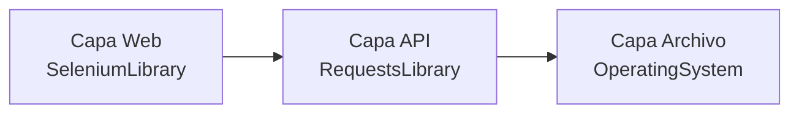

# Capítulo 8 — Robot Framework Aplicado a RPA

## Información general

Este capítulo retoma el segundo dominio de Robot Framework presentado en la Sesión 1: la RPA. Aquí dejas de verificar comportamiento (PASS/FAIL) y empiezas a ejecutar procesos de negocio completos, con manejo de archivos, orquestación de varias capas tecnológicas, y trazabilidad operativa — con ejemplos de código completos en cada lección.

**Lecciones de este capítulo:**

- 8.1 — Automatización de archivos: CSV, Excel (openpyxl), PDF y gestión de carpetas
- 8.2 — Orquestación de procesos: entrada/salida, parametrización y variables de proceso
- 8.3 — Integración E2E: web + API + archivos en un único flujo RPA
- 8.4 — Manejo de errores en RPA: retries, timeouts, control de fallas
- 8.5 — Logging, trazabilidad y estandarización en RPA

---

## 8.1 Automatización de archivos: CSV, Excel, PDF y gestión de carpetas

### Objetivos de la lección

- Identificar las librerías Python para trabajar con cada formato de archivo.
- Aplicar lectura/escritura de Excel desde una librería propia.
- Generar un reporte en PDF desde datos procesados.

### ¿Por qué importa?

En procesos RPA, los archivos son el medio de entrada/salida más común: facturas, reportes, listados de clientes. Saber qué librería usar para cada formato — y por qué no necesitas licencias de Office para ninguna de ellas — es la base técnica de cualquier proceso RPA.

### Conceptos clave

#### Las librerías por formato

| Formato | Librería | Nativa de Python |
|---|---|---|
| CSV | `csv` (módulo estándar) | Sí, sin instalar nada |
| Excel (`.xlsx`) | `openpyxl` | No, `pip install openpyxl` |
| PDF (generar) | `fpdf2` | No, `pip install fpdf2` |
| PDF (leer texto existente) | `pdfplumber` | No, `pip install pdfplumber` |

Ninguna de estas librerías requiere Microsoft Office instalado — todas trabajan directamente con el formato de archivo, sin depender de una aplicación externa.

#### El patrón recomendado: Python puro + pytest + keyword

El patrón recomendado, ya familiar desde el Capítulo 5, es separar la lógica en funciones Python puras, probarlas con `pytest` antes de tocar Robot Framework, y exponerlas como keywords:

```python
@dataclass
class Cliente:
    nombre: str
    plan: str
    consumo_gb: float
    costo_base: float
    costo_total: float = 0.0


def leer_clientes_excel(ruta_excel: str | Path) -> list[Cliente]:
    """Lee la hoja 'Clientes' de un Excel y devuelve una lista de Cliente."""
    ruta = Path(ruta_excel)
    if not ruta.is_file():
        raise FileNotFoundError(f"No existe el archivo: {ruta}")
    wb = openpyxl.load_workbook(ruta, data_only=True)
    hoja = wb["Clientes"]
    clientes = []
    for fila in hoja.iter_rows(min_row=2, values_only=True):
        if fila[0] is None:
            continue
        nombre, plan, consumo_gb, costo_base = fila
        clientes.append(Cliente(nombre=nombre, plan=plan, consumo_gb=consumo_gb, costo_base=costo_base))
    return clientes
```

La orquestación del proceso vive en `.robot`, la lógica de cada paso vive en Python — la misma división de responsabilidades que conociste en el Capítulo 5, aplicada ahora al dominio RPA.

#### Generar un reporte PDF desde datos procesados

```python
def generar_reporte_pdf(clientes: list[Cliente], ruta_salida: str | Path) -> Path:
    pdf = FPDF()
    pdf.add_page()
    pdf.set_font("Helvetica", "B", 14)
    pdf.cell(0, 10, "Reporte de Clientes", new_x="LMARGIN", new_y="NEXT")
    for cliente in clientes:
        pdf.cell(0, 8, f"{cliente.nombre} - {cliente.plan} - Q{cliente.costo_total:.2f}", new_x="LMARGIN", new_y="NEXT")
    ruta = Path(ruta_salida)
    ruta.parent.mkdir(parents=True, exist_ok=True)
    pdf.output(str(ruta))
    return ruta
```

`fpdf2` construye el documento de forma incremental (página, fuente, celdas de texto) y lo guarda con `output()` — un modelo de construcción imperativo, distinto al de lectura de Excel, pero igualmente simple de usar desde una keyword propia.

### Ejemplo comentado

```robot
*** Settings ***
Library    ../scripts/procesar_clientes.py
Library    OperatingSystem


*** Test Cases ***
Leer Excel Y Generar Reporte PDF
    @{clientes}=    Leer Clientes Excel    ${CURDIR}/../data/clientes.xlsx
    @{transformados}=    Transformar Clientes    ${clientes}
    ${ruta}=    Generar Reporte Pdf    ${transformados}    ${CURDIR}/../reportes/reporte.pdf
    File Should Exist    ${ruta}
```

### Tabla de referencia rápida

| Pregunta del examen RFCP (estilo) | Respuesta |
|---|---|
| ¿Qué librería lee/escribe archivos `.xlsx` sin Office? | `openpyxl` |
| ¿Qué librería genera PDFs desde Python? | `fpdf2` |
| ¿El módulo `csv` requiere instalación adicional? | No, es parte de la librería estándar de Python |

### Errores comunes

- **Intentar leer un `.xlsx` con el módulo `csv`** — son formatos binarios distintos; `.xlsx` requiere `openpyxl` (o una librería equivalente).
- **Olvidar `ruta.parent.mkdir(parents=True, exist_ok=True)` antes de guardar un archivo de salida** — falla si la carpeta destino no existe todavía.
- **No probar la función de lectura/transformación con pytest antes de integrarla** — dificulta saber si un fallo viene de la lógica o de la integración con Robot Framework.

### Autoevaluación

1. ¿Qué librería usarías para leer un archivo Excel `.xlsx` desde Python?
2. ¿Es necesario tener Microsoft Office instalado para usar `openpyxl` o `fpdf2`?
3. ¿Dónde debería vivir la lógica de transformación de datos: en el archivo `.robot` o en una función Python separada?

**Respuestas:** 1. `openpyxl`. 2. No, ninguna de las dos librerías lo requiere. 3. En una función Python separada, probada con pytest antes de exponerse como keyword — el patrón recomendado desde el Capítulo 5.

---

## 8.2 Orquestación de procesos: entrada/salida, parametrización y variables de proceso

### Objetivos de la lección

- Describir el concepto de entrada/salida en un proceso RPA.
- Aplicar logging explícito por etapa para mejorar la diagnosticabilidad.
- Usar expresiones Python embebidas para cálculos simples dentro de un valor.

### ¿Por qué importa?

Un proceso RPA que corre sin nadie observando la pantalla necesita poder explicarse a sí mismo después de los hechos — si algo sale mal a las 2am, el log es la única fuente de información disponible para diagnosticar qué ocurrió.

### Conceptos clave

#### Entradas y salidas explícitas

Un proceso RPA modela explícitamente sus **entradas** (un archivo, una variable de línea de comandos, una llamada a una API) y sus **salidas** (un archivo generado, un registro creado, una notificación enviada). A diferencia de un test, que termina en un veredicto PASS/FAIL, un proceso RPA termina en un **resultado operativo** concreto y verificable — un archivo que existe y tiene contenido, no solo una aserción lógica.

#### Por qué el logging explícito por etapa es indispensable

El **logging explícito por etapa** es una práctica fundamental en RPA:

```robot
Log    ETAPA 1/3: Leyendo clientes desde ${ARCHIVO_ENTRADA}
@{clientes}=    Leer Clientes Excel    ${ARCHIVO_ENTRADA}
Log    ETAPA 1/3 completada: ${{len($clientes)}} clientes leídos

Log    ETAPA 2/3: Transformando datos
@{clientes_transformados}=    Transformar Clientes    ${clientes}
Log    ETAPA 2/3 completada
```

Cuando el proceso corre desatendido (sin nadie observando la pantalla), el log es la única ventana hacia lo que realmente ocurrió. Sin logging granular, diagnosticar un fallo en producción significa adivinar en qué punto del proceso algo salió mal — con logging por etapa, el último mensaje visible en el log indica exactamente dónde se detuvo el proceso.

#### Expresiones Python embebidas: `${{...}}`

La sintaxis `${{expresión}}` (doble llave) le indica a Robot Framework que evalúe lo que está dentro como **código Python real**, usando el prefijo `$nombre` (sin llaves) para referenciar variables de Robot Framework dentro de esa expresión:

```robot
Log    ETAPA 1/3 completada: ${{len($clientes)}} clientes leídos
```

Aquí, `$clientes` se resuelve a la lista real de objetos Python, y `len(...)` es la función estándar de Python aplicada directamente — sin necesitar una keyword adicional solo para contar elementos. Esta sintaxis es útil para cálculos simples de una línea; para lógica más compleja, sigue siendo preferible extraerla a una keyword Python propia (Capítulo 5).

#### Variables de proceso: estado del robot

En procesos RPA más largos, las "variables de proceso" almacenan el estado acumulado del robot a lo largo de su ejecución: contadores de registros procesados, una lista de errores encontrados para reportar al final, un identificador único de la ejecución (`ID_EJECUCION`) generado al inicio para correlacionar todos los logs de esa corrida específica.

### Ejemplo comentado

```robot
*** Test Cases ***
Proceso RPA Completo Con Logging Por Etapa
    [Documentation]    Cada etapa se registra explícitamente — si el
    ...                proceso falla, el último mensaje visible indica
    ...                dónde se detuvo.
    Log    ETAPA 1/3: Leyendo clientes desde ${ARCHIVO_ENTRADA}
    @{clientes}=    Leer Clientes Excel    ${ARCHIVO_ENTRADA}
    Log    ETAPA 1/3 completada: ${{len($clientes)}} clientes leídos

    Log    ETAPA 2/3: Transformando datos (IVA + clasificación de consumo)
    @{clientes_transformados}=    Transformar Clientes    ${clientes}
    Log    ETAPA 2/3 completada

    Log    ETAPA 3/3: Generando reporte PDF en ${ARCHIVO_SALIDA}
    ${ruta_generada}=    Generar Reporte Pdf    ${clientes_transformados}    ${ARCHIVO_SALIDA}
    Log    ETAPA 3/3 completada: reporte en ${ruta_generada}
```

### Tabla de referencia rápida

| Pregunta del examen RFCP (estilo) | Respuesta |
|---|---|
| ¿Qué produce un proceso RPA al terminar, a diferencia de un test? | Un resultado operativo, no un veredicto PASS/FAIL |
| ¿Qué sintaxis evalúa código Python embebido dentro de un valor de RF? | `${{expresión}}` (doble llave) |
| ¿Por qué es indispensable el logging por etapa en RPA? | Porque el proceso corre desatendido; el log es la única evidencia disponible |

### Errores comunes

- **No registrar el inicio/fin de cada etapa**, dejando un único log genérico al final del proceso — dificulta saber en qué etapa ocurrió un fallo.
- **Usar `${{...}}` para lógica compleja de varias líneas** — la sintaxis está pensada para expresiones simples; lógica más elaborada debería ser una keyword Python propia.
- **No definir un identificador único de ejecución** en procesos que corren repetidamente — dificulta correlacionar los logs de una corrida específica cuando varias ejecuciones se superponen en el tiempo.

### Autoevaluación

1. ¿Qué diferencia el resultado final de un proceso RPA del resultado final de un test?
2. ¿Qué sintaxis usarías para contar cuántos elementos tiene una lista, embebiendo Python directamente en un `Log`?
3. ¿Por qué el logging por etapa es más importante en RPA que en una suite de pruebas típica?

**Respuestas:** 1. Un proceso RPA produce un resultado operativo (archivo, registro); un test produce un veredicto PASS/FAIL. 2. `${{len($variable)}}`. 3. Porque un proceso RPA suele correr desatendido (sin nadie observando), y el log es la única fuente de diagnóstico disponible después de los hechos.

---

## 8.3 Integración E2E: web + API + archivos en un único flujo RPA

### Objetivos de la lección

- Diseñar un proceso que combine varias tecnologías en capas secuenciales.
- Aplicar el patrón de traspaso de datos entre capas.
- Mantener cada capa enfocada en su librería correspondiente.

### ¿Por qué importa?

Los procesos RPA del mundo real casi nunca usan una sola tecnología — y sin un patrón claro de cómo combinarlas, el código tiende a mezclar responsabilidades de forma que cualquier cambio en una tecnología obliga a tocar código que debería ser independiente de ella.

### Conceptos clave

#### Por qué los flujos reales combinan tecnologías

Es común que un proceso RPA navegue un sitio web para extraer un dato (capa web), lo envíe a un sistema externo vía API (capa API), y registre el resultado en un archivo local para trazabilidad (capa archivo) — las tres tecnologías que ya conoces de capítulos anteriores, combinadas en un solo flujo secuencial dentro de un mismo proceso.



```{=typst}
#flujo(("Capa Web (SeleniumLibrary)", "Capa API (RequestsLibrary)", "Capa Archivo (OperatingSystem)"))
```

#### El traspaso de datos entre capas

El traspaso de datos entre capas se hace con **variables de Robot Framework**: el valor extraído en la capa web se pasa como argumento a la keyword de la capa API, y el resultado de esa llamada (junto con el dato original) se pasa a la capa de archivo:

```robot
${apellido_extraido}=    Get Text    ${SELECTOR_NOMBRE}
# El dato de la capa web se pasa a la capa API
&{payload}=    Create Dictionary    apellido_cliente=${apellido_extraido}
${respuesta}=    POST On Session    api    /post    json=${payload}
# El dato original Y el resultado de la API se pasan a la capa archivo
Append To File    ${ARCHIVO_SALIDA}    ${apellido_extraido},${respuesta.status_code}\n
```

#### Cada capa mantiene su librería correspondiente

Cada capa debería seguir usando su librería correspondiente (`SeleniumLibrary` para la capa web, `RequestsLibrary` para la capa API, `OperatingSystem` para la capa de archivos) **sin mezclar responsabilidades** — la capa API no debería conocer detalles de cómo se extrajo el dato de la página web, solo debería recibirlo como un argumento ya resuelto.

### Ejemplo comentado

```robot
*** Test Cases ***
Proceso RPA E2E: Extraer, Registrar Vía API Y Archivar
    [Teardown]    Close All Browsers

    Log    CAPA WEB: extrayendo dato de la tabla
    Open Browser    ${URL_TABLA}    headlesschrome
    Wait Until Element Is Visible    ${SELECTOR_NOMBRE}    timeout=10s
    ${apellido_extraido}=    Get Text    ${SELECTOR_NOMBRE}

    Log    CAPA API: registrando el dato extraído
    &{payload}=    Create Dictionary    apellido_cliente=${apellido_extraido}    origen=rpa-e2e
    ${respuesta}=    POST On Session    api    /post    json=${payload}

    Log    CAPA ARCHIVO: registrando el resultado localmente
    Create Directory    ${CURDIR}/../salida
    Append To File    ${ARCHIVO_SALIDA}    ${apellido_extraido},${respuesta.status_code}\n
```

Observa cómo cada capa registra su inicio con `Log` (la práctica de la lección 8.2), y cómo el dato fluye linealmente de una capa a la siguiente sin que ninguna capa necesite conocer el detalle interno de la anterior.

### Tabla de referencia rápida

| Capa | Librería | Recibe de la capa anterior |
|---|---|---|
| Web | `SeleniumLibrary` | (es la primera capa) |
| API | `RequestsLibrary` | El dato extraído de la web, como argumento |
| Archivo | `OperatingSystem` | El dato original + el resultado de la API |

### Errores comunes

- **Llamar a `SeleniumLibrary` desde dentro de una keyword de la capa API** — mezcla responsabilidades; cada capa debería recibir datos ya resueltos, no ir a buscarlos ella misma a otra capa.
- **No capturar el dato extraído en una variable antes de pasarlo a la siguiente capa** — sin esa captura explícita, no hay forma de encadenar el flujo.
- **Omitir el `Teardown` que cierra el navegador** cuando el flujo incluye una capa web — deja procesos de navegador abiertos si el flujo falla a mitad de camino.

### Autoevaluación

1. ¿Qué librería correspondería a la "capa archivo" de un flujo E2E?
2. ¿Cómo se traspasa un dato de la capa web a la capa API en Robot Framework?
3. ¿Debería la capa API conocer el selector CSS usado para extraer un dato en la capa web?

**Respuestas:** 1. `OperatingSystem`. 2. Capturándolo en una variable de Robot Framework y pasándolo como argumento a la keyword de la capa API. 3. No — cada capa debe mantenerse enfocada en su tecnología, recibiendo datos ya resueltos de la capa anterior.

---

## 8.4 Manejo de errores en RPA: retries, timeouts y control de fallas

### Objetivos de la lección

- Aplicar `Run Keyword And Return Status` para validaciones booleanas simples.
- Diseñar un checklist de calidad explícito por capa.
- Diferenciar este patrón de los tres del Capítulo 3.

### ¿Por qué importa?

En un proceso de varias capas, un fallo en una sola capa no debería producir un mensaje de error genérico al final — debe ser **localizable**: ¿falló la extracción web, la llamada API, o la escritura del archivo? Sin esa localización, diagnosticar un fallo en producción se vuelve mucho más lento.

### Conceptos clave

#### Por qué un assert ciego no es suficiente en un proceso de varias capas

Un único `Should Be True` al final de un proceso de tres capas, validando todo de golpe, no te dice **cuál** de las tres capas falló — solo que "algo" no salió bien. Para procesos RPA, donde diagnosticar rápido importa operativamente, esto es insuficiente.

#### El checklist de calidad explícito

Un **checklist de calidad** explícito valida cada capa por separado y registra el resultado (`PASS`/`FAIL`) de cada una en el log **antes** de fallar el test, resolviendo el problema de diagnosticabilidad:

```robot
*** Keywords ***
Ejecutar Checklist De Calidad
    [Arguments]    ${apellido}    ${status_api}    ${ruta_archivo}
    ${checklist}=    Create List

    ${item_web}=    Set Variable If    """${apellido}""" != ""    PASS    FAIL
    Append To List    ${checklist}    Capa Web (dato no vacío): ${item_web}

    ${item_api}=    Set Variable If    ${status_api} == 200    PASS    FAIL
    Append To List    ${checklist}    Capa API (status 200): ${item_api}

    ${archivo_existe}=    Run Keyword And Return Status    File Should Exist    ${ruta_archivo}
    ${item_archivo}=    Set Variable If    ${archivo_existe}    PASS    FAIL
    Append To List    ${checklist}    Capa Archivo (existe): ${item_archivo}

    FOR    ${item}    IN    @{checklist}
        Log    CHECKLIST: ${item}
    END

    Should Not Contain    ${checklist}    Capa Web (dato no vacío): FAIL
    Should Not Contain    ${checklist}    Capa API (status 200): FAIL
    Should Not Contain    ${checklist}    Capa Archivo (existe): FAIL
```

Si la capa API falla, el log mostrará explícitamente `CHECKLIST: Capa API (status 200): FAIL` junto a las otras dos capas en `PASS` — localizando el problema sin ambigüedad, antes incluso de que el test termine de fallar.

#### Run Keyword And Return Status

`Run Keyword And Return Status` (similar a `Run Keyword And Ignore Error`, visto en el Capítulo 3, pero devolviendo **solo** el booleano de éxito/fallo, sin el mensaje) es útil precisamente para construir este tipo de checklist, donde solo necesitas saber si una verificación pasó o no, sin propagar la excepción original ni necesitar el mensaje de error detallado.

| Keyword (Capítulo 3) | Qué devuelve | Uso típico en checklist |
|---|---|---|
| `Run Keyword And Ignore Error` | `(estado, mensaje)` | Cuando necesitas el mensaje de error |
| `Run Keyword And Return Status` | Solo `True`/`False` | Cuando solo necesitas el booleano, como en un checklist |

### Ejemplo comentado

Ver el bloque de `Ejecutar Checklist De Calidad` arriba — es el ejemplo central de esta lección, combinando `FOR` (Capítulo 3), `Set Variable If`, y `Run Keyword And Return Status` en un patrón reutilizable para cualquier proceso de varias capas.

### Tabla de referencia rápida

| Pregunta del examen RFCP (estilo) | Respuesta |
|---|---|
| ¿Qué devuelve `Run Keyword And Return Status`? | Solo un booleano (`True`/`False`) |
| ¿En qué se diferencia de `Run Keyword And Ignore Error`? | Esta última también devuelve el mensaje de error |
| ¿Qué resuelve un checklist de calidad explícito que un assert único no resuelve? | Localiza en qué capa específica ocurrió el fallo |

### Errores comunes

- **Usar un único `Should Be True` para validar las tres capas de golpe** — no localiza cuál capa específicamente falló.
- **Usar `Run Keyword And Ignore Error` cuando solo necesitas el booleano** — agrega un valor de retorno (el mensaje) que no se usa, complicando innecesariamente el código.
- **No registrar el checklist en el log antes de fallar** — si el test falla antes de que el `FOR` con los `Log` se ejecute, se pierde la visibilidad que el patrón busca dar.

### Puntos clave

- Un checklist de calidad explícito localiza el fallo en la capa correspondiente, en vez de un mensaje de error genérico.
- `Run Keyword And Return Status` devuelve solo el booleano de éxito/fallo (sin mensaje), ideal para checklists donde no necesitas el detalle del error.
- Este patrón complementa, no reemplaza, los tres patrones de manejo de fallas del Capítulo 3.

### Autoevaluación

1. ¿Qué problema de diagnóstico resuelve un checklist de calidad explícito frente a un assert único?
2. ¿Qué keyword devuelve solo un booleano, sin mensaje de error, ante el resultado de otra keyword?
3. ¿En qué se diferencia `Run Keyword And Return Status` de `Run Keyword And Ignore Error`?

**Respuestas:** 1. Localiza específicamente en qué capa ocurrió el fallo, en vez de un mensaje genérico de "algo falló". 2. `Run Keyword And Return Status`. 3. `Return Status` devuelve solo el booleano; `Ignore Error` devuelve el booleano y además el mensaje de error.

---

## 8.5 Logging, trazabilidad y estandarización en RPA

### Objetivos de la lección

- Explicar por qué la trazabilidad es crítica en procesos RPA empresariales.
- Describir el rol de `output.xml` como fuente de auditoría.
- Aplicar estandarización de formato de mensajes de log entre procesos.

### ¿Por qué importa?

A diferencia de una suite de pruebas (que se ejecuta y se descarta una vez interpretado el resultado), un proceso RPA empresarial a menudo necesita **evidencia auditable** de cada ejecución — qué se procesó, cuándo, con qué resultado — por requerimientos de cumplimiento o de auditoría interna.

### Conceptos clave

#### output.xml como registro de auditoría

El mismo `output.xml` que Robot Framework genera para cualquier ejecución — ya familiar desde el Capítulo 1 — cumple este rol de auditoría: contiene el detalle completo de cada keyword ejecutada, con sus argumentos y mensajes de `Log`, sirviendo como registro completo **sin necesidad de construir un sistema de logging adicional** desde cero. Para procesos RPA con requisitos de auditoría formales, conservar el `output.xml` de cada ejecución (no solo los reportes HTML derivados) es la práctica recomendada, porque es la fuente de verdad completa.

#### Estandarizar el formato de los mensajes

Estandarizar el formato de los mensajes de log entre distintos procesos RPA de un mismo equipo facilita que cualquier persona del equipo pueda diagnosticar un proceso ajeno sin tener que descifrar una convención distinta cada vez:

```
ETAPA N/M: <descripción de qué está haciendo esta etapa>
ETAPA N/M completada: <resultado breve de esta etapa>
CHECKLIST: <nombre de la capa> (<qué se valida>): PASS/FAIL
```

Esta convención (la misma usada en las lecciones 8.2 y 8.4 de este capítulo) no es una regla impuesta por Robot Framework — es una decisión de diseño del equipo, pero su consistencia entre procesos distintos es lo que realmente aporta valor: un ingeniero que nunca vio el proceso A puede diagnosticarlo rápidamente si ya conoce la convención usada en el proceso B.

#### Procesar output.xml programáticamente

Para necesidades de auditoría más sofisticadas (dashboards, alertas automáticas basadas en resultados históricos), `output.xml` puede procesarse directamente con Python, usando la librería estándar `xml.etree.ElementTree` — la misma técnica que usaste en el Capítulo 1 para extraer métricas de una ejecución, aplicable también a procesos RPA, no solo a suites de pruebas.

### Ejemplo comentado

```python
"""Extrae métricas de un output.xml de un proceso RPA para un dashboard
de auditoría — la misma técnica vista en el Capítulo 1, Práctica 2."""
import xml.etree.ElementTree as ET

def extraer_metricas_auditoria(ruta_output_xml: str) -> dict:
    arbol = ET.parse(ruta_output_xml)
    nodo_total = arbol.find("./statistics/total/stat")
    return {
        "pasados": int(nodo_total.get("pass", 0)),
        "fallidos": int(nodo_total.get("fail", 0)),
        "timestamp_ejecucion": arbol.getroot().get("generated"),
    }
```

### Tabla de referencia rápida

| Pregunta del examen RFCP (estilo) | Respuesta |
|---|---|
| ¿Qué artefacto sirve como registro de auditoría completo? | `output.xml` |
| ¿Es necesario un sistema de logging adicional para auditoría básica? | No, `output.xml` ya lo cubre |
| ¿Qué librería de Python procesa `output.xml` programáticamente? | `xml.etree.ElementTree` (estándar, sin instalar nada) |

### Errores comunes

- **Borrar el `output.xml` de ejecuciones pasadas** cuando hay un requisito de auditoría formal — es la fuente de verdad completa; los reportes HTML son solo vistas derivadas.
- **Usar un formato de mensaje distinto en cada proceso RPA del equipo** — dificulta que cualquier persona del equipo diagnostique un proceso que no escribió.
- **Construir un sistema de logging externo desde cero** cuando `output.xml` ya cubre las necesidades básicas de auditoría — esfuerzo innecesario para el alcance real del problema.

### Puntos clave

- `output.xml` sirve como registro de auditoría completo, sin necesidad de sistemas de logging adicionales para necesidades básicas.
- Estandarizar el formato de los mensajes de log entre procesos facilita el diagnóstico por cualquier miembro del equipo, no solo el autor original.
- `xml.etree.ElementTree` (librería estándar de Python) es suficiente para procesar `output.xml` programáticamente, sin instalar nada adicional.

### Autoevaluación

1. ¿Qué artefacto de Robot Framework cumple el rol de registro de auditoría, sin construir nada adicional?
2. ¿Por qué estandarizar el formato de los mensajes de log entre procesos distintos del mismo equipo aporta valor?
3. ¿Qué librería de Python (sin instalación adicional) procesa `output.xml`?

**Respuestas:** 1. `output.xml`. 2. Porque permite que cualquier persona del equipo diagnostique un proceso ajeno sin aprender una convención nueva cada vez. 3. `xml.etree.ElementTree`.

---

## Resumen del capítulo

Los procesos RPA automatizan archivos (CSV, Excel, PDF) con el mismo patrón Python+pytest+keyword del Capítulo 5, sin depender de Microsoft Office. Modelan entradas/salidas explícitas, con logging granular por etapa (incluyendo expresiones Python embebidas `${{...}}` para cálculos simples), indispensable cuando corren desatendidos. Los flujos E2E combinan capas (web, API, archivos) secuenciales, traspasando datos entre ellas por variables, cada capa enfocada en su librería correspondiente. Un checklist de calidad explícito, construido con `Run Keyword And Return Status`, localiza el fallo en la capa correspondiente — complementando, no reemplazando, los tres patrones de manejo de fallas del Capítulo 3. `output.xml` provee trazabilidad auditable sin sistemas adicionales, y estandarizar el formato de los mensajes de log entre procesos del mismo equipo acelera el diagnóstico colectivo.

## Referencias bibliográficas

- openpyxl: <https://openpyxl.readthedocs.io/>
- fpdf2: <https://py-pdf.github.io/fpdf2/>
- Run Keyword And Return Status: <https://robotframework.org/robotframework/latest/libraries/BuiltIn.html#Run%20Keyword%20And%20Return%20Status>

```{=typst}
#pagebreak()
```
